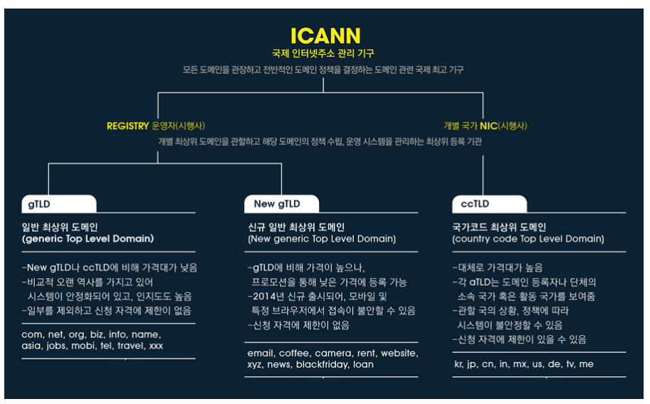

### 1Day 1CS

##### 2021.04.12

#### :heavy_check_mark:DNS작동의 흐름과정에 대해 설명하시오

1. 웹 브라우저에 www.naver.com을 입력하면 먼저 Local DNS에 "www.naver.com"이라는 hostname에 대한 IP 주소를 질의하여 Local DNS에 없으면 다른 DNS name 서버 정보를 받음(Root DNS 정보를 전달 받음)

`Root DNS란 인터넷 도메인 네임 시스템의 루트존이다. 루트 존은 레코드의 요청에 직접 응답하고 적절한 최상위 도메인에 대해 권한이 있는 네임 서버 목록을 반환함으로서 다른 요청에 응답한다. 전세계에는 961개의 루트 DNS가 존재한다.`

2. Root DNS 서버에 www.naver.com 질의
3. Root DNS 서버로부터 com 도메인을 관리하는 <b>TLD(Top-Level Domain)</b> 이름 서버 정보를 전달 받음 `여기서의 TLD는 com도메인은 관리하는 서버를 지칭함`
4. TLD에 www.naver.com 질의
5. TLD에서 "name.com"을 관리하는 DNS에 정보 전달
6. naver.com 도메인을 관리하는 DNS 서버에 www.naver.com 호스트 네임에 대한 IP 주소 질의
7. Local DNS서버에게 www.naver.com의 IP주소 응답
8. Local DNS는 www.naver.com에 대한 IP주소를 캐싱하고 IP주소 정보 전달

참조 래퍼런스

(https://velog.io/@goban/DNS%EC%99%80-%EC%9E%91%EB%8F%99%EC%9B%90%EB%A6%AC)