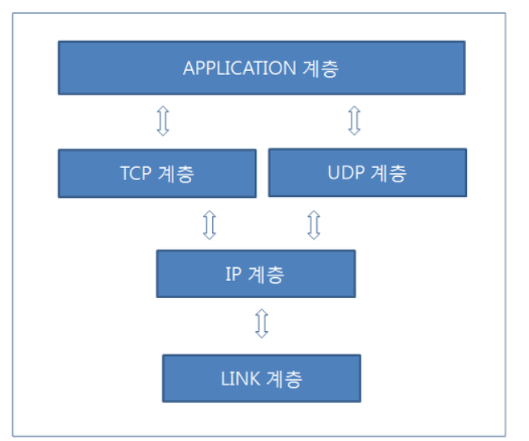

### 1Day 1CS

##### 2021.04.05 (오늘은 조금 많이)

##### :heavy_check_mark: TCP-IP 프로토콜 스택을 4계층으로 구분 후 각 계층을 설명하시오

- <b>데이터 링크 계층</b>
  - 물리적인 영역의 표준화에 대한 결과, 가장 기본이 되는 영역으로 LAN,WAN,MAN과 같은 <b>네트워크 표준과 관련된 프로토콜을 정의</b>하는 영역
- <b>네트워크 계층</b>
  - <b>경로검색을 해주는 계층</b>, IP 자체는 비연결지향적이며 신뢰할 수 없는 프로토콜이다. 데이터를 전송할 때 마다 거쳐야할 경로를 선택해주지만, 그 경로는 일정하지 않다. 특히 <b>데이터 전송 도중에 경로상에 문제가 발생하면 다른 경로를 선택해 주는데, 이 과정에서 데이터가 손실과거나 오류가 발생한다고 해서 이를 해결해주지 않는다.</b> 즉 오류 발생에 대한 대비가 되어있지 않은 프로토콜이다.

- <b>전송 계층</b>
  - 데이터의 실제 송/수신을 담당하는 계층, UDP는 TCP에 비해 상대적으로 간단하며, TCP는 신뢰성 있는 데이터의 전송을 담당한다. 그런데 TCP가 데이터를 보낼 때 기반이되는 프로토콜은 IP이다. 앞서 말했듯 IP계층은 문제가 발생했을때 이를 해결해주는 계층이 아니다. 이러한 문제를 해결해주는 계층이 TCP이며, 데이터가 순서에 맞게 올바르게 전송이 갔는지를 확인해주며 대화를 주고 받는다. 즉 <B>전송계층은 신뢰성이 없는 IP계층에 확인절차를 거쳐서 신뢰성을 부여해주는 계층이자 프로토콜</B>
  - IP는 오로지 하나의 패킷 전송만을 염두해 두고 만들어졌기 때문에 패킷A가 네트워크 계층을 통해서 보내졌어도 패킷B가 먼저 도착할 수 있음. 그러나 TCP 프로토콜을 추가함으로서 데이터 송/수신 확인절차를 거치므로 신뢰성이 증가함
- <b>응용 계층</b>
  - 소켓을 활용해 무엇인가를 만드는 과정에서 프로그램의 성격에 따라 클라이언트와 서버간의 데이터 송/수신 규칙들을 APPLICATION 프로토콜 이라고 한다.

참조 래퍼런스

(https://91ms.tistory.com/5)

(https://taesun1114.tistory.com/entry/TCP-IP-%ED%94%84%EB%A1%9C%ED%86%A0%EC%BD%9C-%EC%8A%A4%ED%83%9D)