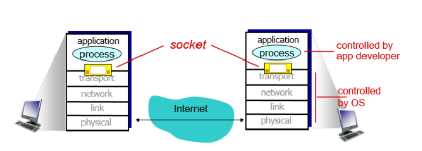
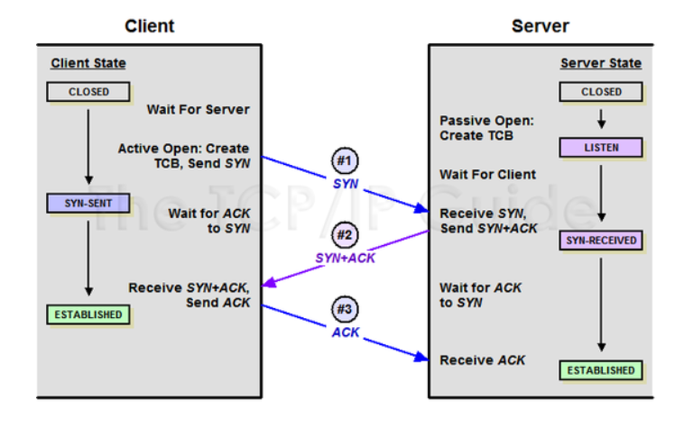
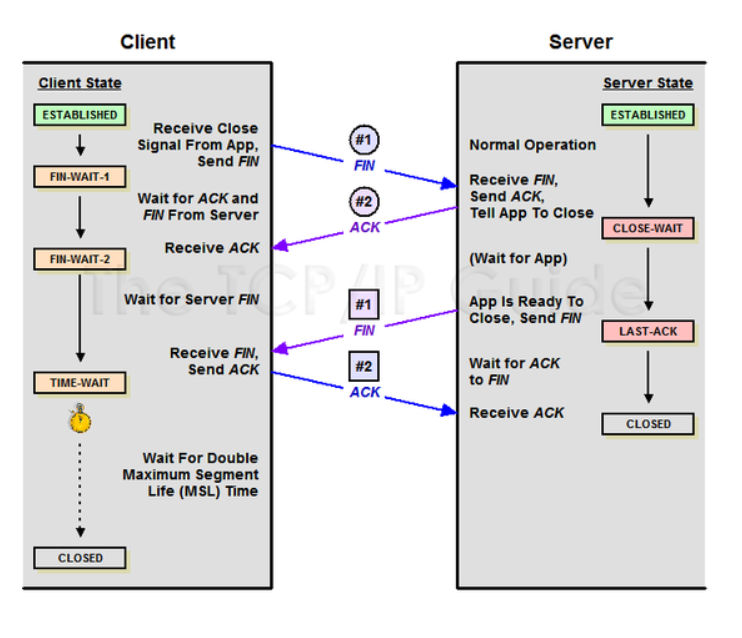

### 1DAY 1CS

##### 2021.04.05

#### :heavy_check_mark:TCP에 대해 설명하시오

###### TCP 공부에 앞서 SOCKET에 대한 이해가 필요

- SOCKET(소켓)

- 소켓은 응용계층과 전송계층의 사이에 위치하며 OS에 의해서 컨트롤 된다.
- 서로 다른 프로세스간의 요청 및 응답을 위해서 네트워크 통신을 위한 프로그램들은 소켓을 생성하고 이 소켓을 통해서 서로 데이터를 교환한다.
- 쉽게 말해서 우체통(socket)에 데이터를 넣으면 우체부가 socket에 있는 데이터를 가지고 받는곳에 위치한 다른 socket으로 데이터를 전송 (우체통이라고 생각하면 편함)

###### TCP 공부 START

- TCP서버의 함수 호출 순서 : socket()생성 -> bind()소켓 주소 할당 -> listen()연결 요청 대기 상태 -> accept() 연결 허용 -> read/write() 데이터 송수신 -> close() 연결종료

- TCP 클라이언트의 함수호출 순서 : socket() 소켓생성 -> connect() 연결요청 -> read()/write() 데이터 송수신 -> close() 연결종료

- 서버와 클라이언트의 차이점은 ‘연결요청’이라는 과정이다. 이는 클라이언트 소켓을 생성한 후에 서버로 연결을 요청하는 과정. 서버는 listen()를 호출한 이후부터 연결요청 대기 큐를 만들어 놓는다. 따라서 그 이후부터 클라이언트는 연결요청을 할 수 있다. 이 때, 서버가 바로 accept()를 호출할 수 있는데 이때는, 연결되기 전까지 호출된 위치에서 블로킹 상태에 놓이게 된다.

  

- 3-way handshaking : TCP 소켓은 연결설정 과정에서 총 세번의 대화를 주고 받는다.

- 4-way handshaking : TCP의 연결종료과정

  - SYN :: Synchronize Sequence Number 연결 요청 플래그
  - ACK :: Acknoledgement 응답
  - 클라이언트는 서버에 접속을 요청하는 SYN(M) 패킷을 보낸다. 
  - 서버는 클라이언트의 요청인 SYN(M)을 받고 클라이언트에게 요청을 수락한다는 ACK(M+1)와 SYN(N)이 설정된 패킷을 발송한다.
  - 클라이언트는 서버의 수락 응답인 ACK(M+1)와 SYN(N) 패킷을 받고 ACK(N+1)를 서버로 보내면 연결이 성립된다.

  

  

  

  

  

  - 클라이언트가 연결을 종료하겠다는 FIN플래그를 전송한다.
  - 서버는 클라이언트의 요청(FIN)을 받고 알겠다는 확인 메세지로 ACK를 보낸다. 그리고나서는 데이터를 모두 보낼 때까지 잠깐 TIME_OUT이 된다.
  - 데이터를 모두 보내고 통신이 끝났으면 연결이 종료되었다고 클라이언트에게 FIN플래그를 전송한다.
  - 클라이언트는 FIN 메세지를 확인했다는 메세지(ACK)를 보낸다.
  - 클라이언트의 ACK 메세지를 받은 서버는 소켓 연결을 Close한다.
  - 클라이언트는 아직 서버로부터 받지 못한 데이터가 있을 것을 대비해 일정 시간 동안 세션을 남겨놓고 잉여 패킷을 기다리는 과정을 거친다. (TIME_WAIT)

 

​	

참조 래퍼런스

(https://91ms.tistory.com/5)

(https://musclebear.tistory.com/2?category=773007)

(https://m.blog.naver.com/yeopil-yoon/221286967971)

(https://suhwanc.tistory.com/100?category=781986)

(https://m.blog.naver.com/PostView.nhn?blogId=neoul0&logNo=120011890773&proxyReferer=https:%2F%2Fwww.google.com%2F)

(https://suhwanc.tistory.com/102?category=781986)

(https://blog.naver.com/netrance/110112688107)