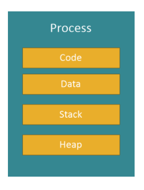
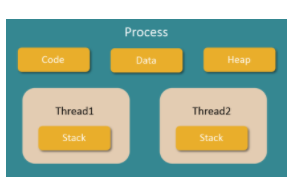
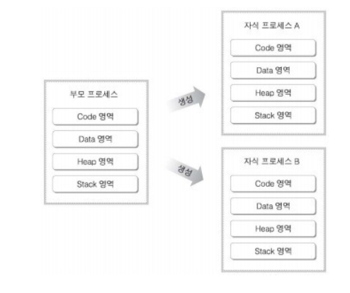
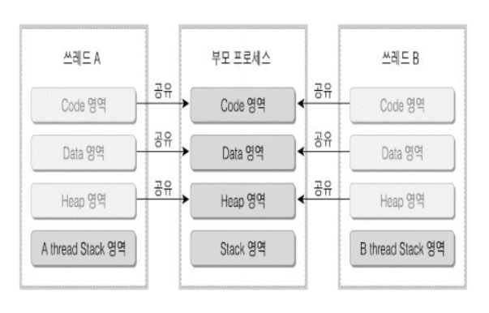

### 1Day 1CS

#### 2021.04.15

##### :1st_place_medal: 프로세스란?

- 쉽게 설명하면 일을 처리하는 일련의 과정을 의미한다
- 정의
  - 운영체제로부터 시스템 자원을 할당받는 작업의 단위
  - 컴퓨터에서 연속적으로 실행되고 있는 프로그램
  - 메모리에 올라와 실행되고 있는 프로그램의 인스턴스를 의미함
  - PCB를 가지고 있는 작업을 의미함
- 하나의 프로세스는 Code , Data, Stack , Heap 영역으로 구성되어 있음
- 
  - Code :  코드 자체를 구성하는 메모리 영역
  - Data : 전역 변수, 정적 변수 , 배열 등 초기와 된 데이터
  - Heap : 동적 할당 시 사용되는 메모리 영역
  - Stack : 지역변수 , 매개변수 , 리턴 값 등 임시 메모리 영역
- Context Switching : 다양한 프로세스를 왔닸다 하면서 소모되는 시간 및 자원을 의미

##### :2nd_place_medal: 스레드란?

- 한 프로세스 내에서 동작되는 여러 실행의 흐름으로 프로세스 하나의 자원을 공유하면서 일련의 여러 과정 여러 개를 동시에 실행시킬 수 있는 것

- 한 프로세서 내의 주소 공간이나 자원들을 대부분 공유
- 기본적으로 하나의 프로세스가 생성되면 하나의 스레드가 같이 생성되며 이를 메인 스레드라고 부름
- 추가적인 스레드를 생성하지 않는 한 모든 프로그램이 메인스레드에서 실행됨
- 하나의 프로세스는 여러 개의 스레드를 가질 수 있으며 이를 멀티 스레드라고 함
- 
- 멀티스레드는 Code , Data , Heap영역을 다른 스레드와 공유하며 Stack영역만을 별도로 가짐
- Stack만을 분리하는 이유는?
  - LIFO(후입 선출)구조의 스택의 특성상 코드와 데이터 , 힙의 경우에는 공유해서 사용하는 것에 문제가 없으나 스택은 쌓일 경우 위에서 부터 프로세스가 내려오므로 복잡해져 원할한 실행흐름의 진행을 위해

#### :pen: 멀티 프로세스와 멀티 쓰레드

##### :1st_place_medal:멀티 프로세스

- 부모 - 자식 관계라고 하더라도 각 프로세스는 자신만의 메모리 영역을 가진다.
- 상속이 가능한 요소(환경변수 , 프로세스 핸들 테이블)이 존재하지만 결국 각기 독립적이다.
- 포로세스 간에 통신을 하기위해서는 IPC(ex. 세마포어 , 큐, 공유메모리)를 통해야 한다.

##### :2nd_place_medal:멀티 스레드

- 하나의 프로세스가 다수개의 작업을 각각 스레드를 이용하여 동시에 작업할 수 있다.
- 스레드는 프로세스의 특정 영역을 공유하며 자신만의 스택영역을 갖기도 한다.

##### :3rd_place_medal:멀티스레드의 이점

- 컨텍스트 스위칭시에 공유 메모리 만큼의 시간 손실이 줄어든다
- 스택을 제외한 메모리를 공유할 수 있다.

##### :3rd_place_medal: 멀티 프로세스 vs 멀티 스레드

- 멀티 프로세스
  - 하나의 컴퓨터에 여러대의 CPU 장착 -> 하나 이상의 프로세스들을 동시에 처리(병렬)
  - 장점
    - 안전성이 높음 (프로세스간 독립된 구조)
  - 단점
    - 각각 독립된 메모리 영역을 갖고 있어, 작업량이 많을수록 오버헤드 발생 및 Context Switching으로 인한 성능 저하
- 멀티 스레드
  - 장점
    - 프로그램의 응답 시간이 단축됨
    - 시스템의 처리율이 향상됨
    - 시스템의 자원 소모가 감소함
    - 통신 방법이 보다 간단한 편
  - 단점
    - 여러 개의 스레드를 이용하는 경우, 변수간의 오류등이 발생 가능
    - 스레드 간 통신할때 충돌이 발생하지 않도록 동기화 문제를 해결해야함
    - 프로그램 디버깅이 어려움
    - 단일 프로세스 시스템에서는 효과를 기대라기 어려움

참고 래퍼런스

(https://you9010.tistory.com/136)

(https://devuna.tistory.com/21)