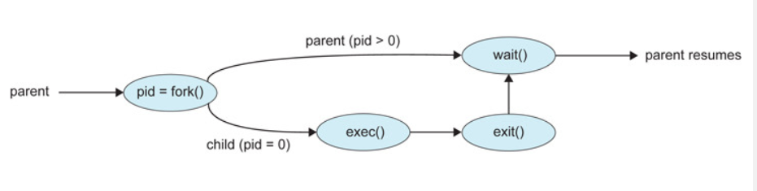

#### 1Day 1Cs

##### :heavy_check_mark: 2002.04.02

##### :grey_question: 프로세스 생성 과정에 대해서 설명해 보세요

- ##### :pencil: 프로세스란?

  - 커널에 등록되고 커널의 관리하에 있는 작업
  - 각종 자원들을 요청하고 할당 받을 수 있는 개체
  - 프로세스 관리 블록(PCB)를 할당받은 개체
    - PCB란?
      - 커널 공간 내에 존재하며 각 프로세스들에 대한 정보를 관리한다.
  - <b>결과적으로 프로세스란 "PCB"를 할당받은 존재라고 생각하면 편하다.</b>

- ##### :pencil: 프로세스의 구조 

  - 프로세스는 크게 네가지의 영역으로 구성됨

    - 1. text : 코드가 있는 영역
      2. data: 변수/초기화 데이터가 존재
      3. stack: 임시 데이터(함수 호출, 로컬 변수 등)이 존재
      4. heap: 코드에서 동적으로 생성되는 데이터
- 
    - stack

      - 프로그램이 자동으로 사용하는 임시 메모리 영역으로 , 지역변수 , 매개변수, 리턴 값등이 일시적으로 존재했다가 사라지는 데이터 임시 저장영역
      - 함수 호출시 생성되고 함수가 끝나면 반환됨
      - stack의 사이즈는 각 프로세스마다 할당되지만 프로세스가 메모리에 로드될때 stack사이즈가 고정되어 있어 런타임 시 stack사이즈를 바꿀 수 없음
      - 명령 실행 시 자동으로 증가/감소하기 때문에 일반적으로 메모리의 마지막 번지를 차지
  - Heap
    
    - 필요에 의해 메모리를 동적으로 할당하고자 하는 동적 메모리 영역, 메모리 주소값에 의해서만 참조되고 사용되는 영역
  - Data
    
    - 프로그램이 실행될 때 생성되고 종료되면 시스템에 반환되어 전역변수 , 배열 , 구조체 , 정적변수 등이 저장됨, 초기화된 데이터는 Data영역에 저장되고 초기화 되지 않은 데이터들은 Bss(Block Stated Symbol) 영역에 저장됨
    
      
- 함수 내부에 선언된 정적변수는 프로그램이 실행될 때 공간만 할당되고 함수 실행시 초기화
      - `Data 영역과 BSS 영역을 구분하는 이유는 다음과 같습니다. 프로그램을 짠 뒤 컴파일하고 링크하고 이미지로 만들어 시스템의 ROM에 저장했다고 가정해볼까요? 이 때 초기화된 데이터는 초기값을 저장해야 하니 Data 영역에 저장되어 ROM에 저장됩니다. 하지만 초기화하지 않은 데이터까지 ROM에 저장한다면 큰 사이즈의 ROM이 필요한데 비용이 많이 들어 RAM에 저장하기 위해 Data 영역과 BSS 영역으로 나눈 것입니다.`
- Code
      - 코드 자체를 구성하는 메모리 영역

- 기타

  - Code, Data, BSS 영역은 컴파일 시 크기가 결정되고 Heap, Stack 영역은 런타임 시 크기가 결정됩니다.

  - Stack의 지역변수는 사용하고 소멸하므로 데이터 용량이 불확실합니다. 그렇기 때문에 밑에서부터 채워올리고 Heap은 위에서부터 채워나갑니다. 이렇게 서로 주소값을 채워나가다가 Heap에서 Stack 방향으로 영역을 침범하는 경우 HEAP overflow라고 하며 반대로 Stack에서 Heap 방향으로 영역을 침범한다면 STACK overflow라고 합니다.

​        

- ###### :computer: 일반적인 프로세스

  -  <b>프로세스 생성의 특징</b>
     -  1. 프로세스는 다른 프로세스에 의해서 생성된다. (즉 부모 프로세스가 자식 프로세스를 만든다)
     -  2. 새로 만들어진 자식 프로세스는 자신의 자식 프로세스를 또 만들 수 있고 결과적으로 프로세스 트리를 형성할 수 있다.
     -  3. 프로세스는 'process id(pid)'를 통해 구분되며 보통은 정수값이며 , 시스템이 시작되면 init 프로세스는 다양한 초기 사용자 프로세스를 생성한다
     -  4. 일반적으로 프로세는 자신의 작업을 수행하기 위해 자원이 필요함(ex. cpu,메모리 등)
           1. 이러한 자원은 자식 프로세스가 운영체제로 부터 직접 받거나
           2. 부모 프로세스로부터 받을 수 있음
  -  <b>프로세스 생성과정</b>
     -  1단계: 부모 프로세스가 fork() 시스템을 호출해서 자식 프로세스 생성, 자식 프로세스는 원래 프로세스 주소공간의 복사본으로 구성 (부프로세스와 자식 프로세스의 쉬운 통신을 위해)
     -  2단계 : 부모나 자식 중 한 프로세스가exec() 시스템을 호출하면서 자신의 메모리 공간을 새롭게 마련한다. 이 과정을 통해 부모 프로세스와 자식 프로세스는 서로 다른 메모리 공간을 갖게되며 각자의 길을 걸음
     -  3단계 : 자식 프로세스가 실행되는 동안 부모 프로세스가 할 일이 없다면 부모 프로세스는 자식 프로세스가 종료 될때 까지 ready queue에서 자신을 제거하기 위해 wait()함수를 호출함
     -  4단계 : 자식 프로세스가 끝나면 exit() 시스템을 호출하여 자식 프로세스 종료 , 부모 프로세스도 wait() 호출에서 나와서 exit()호출 해서 제거
  -  

참고 래퍼런스

(https://velog.io/@ckstn0777/OS-%ED%94%84%EB%A1%9C%EC%84%B8%EC%8A%A4)

(https://velog.io/@underlier12/OS-14-%ED%94%84%EB%A1%9C%EC%84%B8%EC%8A%A4-%EA%B5%AC%EC%A1%B0)

(https://recorda.tistory.com/entry/20160503%ED%94%84%EB%A1%9C%EC%84%B8%EC%8A%A4-%EB%A9%94%EB%AA%A8%EB%A6%AC-%EA%B5%AC%EC%A1%B0)

