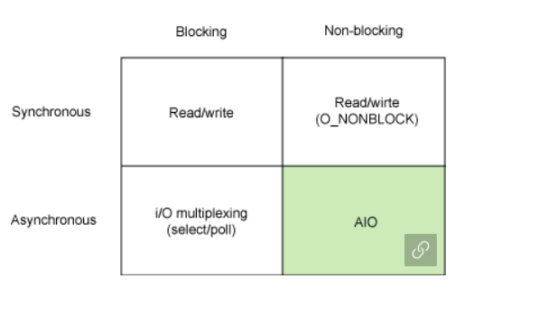

### 1Day 1CS

##### 2021.04.13

#### :1st_place_medal: 동기와 비동기의 차이

##### 	:pencil:동기

- 동기식 처리모델은 데이터의 요청과 결과가 한 자리에서 동시에 일어남

- 즉 사용자가 서버에게 요청을 한다면 서버는 해당 응답을 사용자에게 리턴하기 전까지 다른일은 할 수가 없다 (ex. 전화통화)

##### :pencil2:비동기

- 데이터의 요청과 응답이 동시에 일어나지 않는다.
- 사용자가 서버에 데이터를 요청한 후 응답을 계속 기다리지 않고 응답이 오는동안 다른일을 할 수 있다 (ex.메일)

  

#### :2nd_place_medal: 동기와 비동기의 장단점

##### :pencil: 동기

- 장점 : 설계가 매우 간단하고 직관적이다
- 단점 : 요청에 따른 결과가 올때 까지 대기해야한다. (무한대기 상태에 빠질 수도 있음)

##### :pencil2: 비동기

- 요청에 따른 결과가 반환되는 시간 동안 다른 작업 수행 가능
- 동기식보다 설계가 복잡하고 논증적임

#### :heavy_check_mark:blocking과 non-blocking의 차이

- 예를들어 크롬 브라우저가 요청한 서버로부터 결과가 반환되기 전까지 사파리, 익스플로러 등 다른 프로그램등은 계속 대기를하고 있으며 이러한 상태를 블록 상태라고 부름
- 크롬이 오래걸려도 다른 프로그램들이 자유롭게 이용할 수 있는 상황을 논블록 이라고 부름
- 블록과 논블록의 차이는 <b>제어권</b>
- 호출한 함수가 호출된 함수에게 제어권을 반납하지 않으면 블로킹, 반납하면 논블로킹

- 아래는 추가정리

참고 래퍼런스

(https://juyeop.tistory.com/22)

(http://blog.naver.com/PostView.nhn?blogId=whdgml1996&logNo=221742732978&parentCategoryNo=&categoryNo=53&viewDate=&isShowPopularPosts=true&from=search)