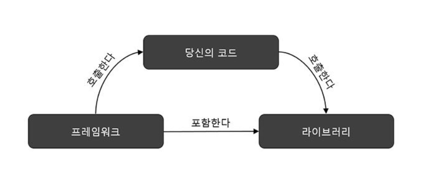
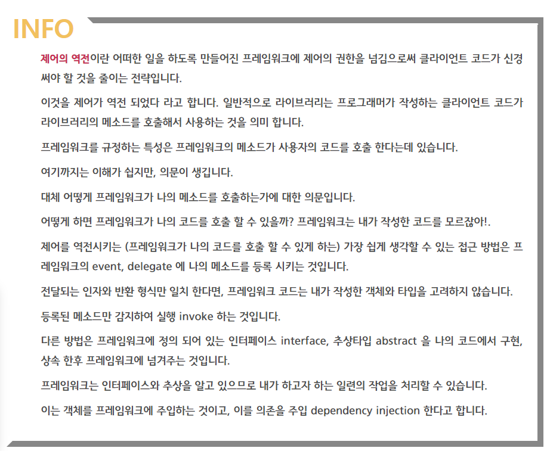

### 1Day 1Cs

##### 2021.04.09

#### :heavy_check_mark: 프레임워크와 라이브러리의 차이점

##### :apple: 프레임워크

- 프레임워크는 뼈대나 기반구조를 뜻하며, 제어의 역전 개념이 적용된 대표적인 기술
- 소프트웨어의 프레임워크는 '소프트웨어의 특정 문제를 해결하기 위해서 상호 협력하는 클래스와 인터페이스의 집합'
- 객체 지향 개발을 하게 되면서 통합성, 일관성의 부족 발생문제를 해결

##### :banana: 프레임워크의 특징

- 특정 개념들의 추상화를 제공하는 여러 클래스와 컴포넌트로 구성됨
- 추상적인 개념들이 문제를 해결하기 위해 같이 작업하는 방법을 정의
- 컴포넌트의 재사용이 가능
- 높은 수준에서 패턴들을 조작화 할 수 있음

##### :green_apple:라이브러리

- 라이브러리는 단순 활용가능한 도구들의 집합
- 개발자가 만든 클래스에서 호출해서 사용
- 클래스의 나열로 필요한 클래스를 불러서 사용

##### :peach: 프레임워크와 라이브러리의 차이점

- 제어 흐름에 대한 주도권이 누구에게 있는가가 가장큰 차이점
- 어플리케이션의 주도권을 누가 가지고 있냐
- 프레임워크는 전체적인 흐름을 스스로 쥐고 있으며 사용자는 그 안에서 코드를 짜넣음
- 라이브러리는 사용자가 전체적인 흐름을 제어하며 라이브러리를 가져다 씀

참고 래퍼런스

(https://webclub.tistory.com/458)