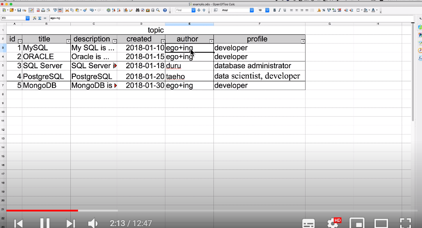
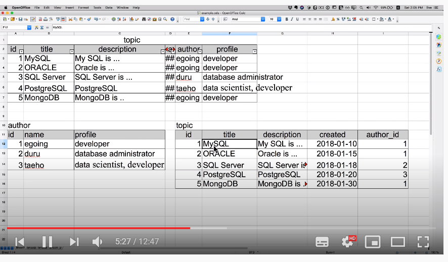
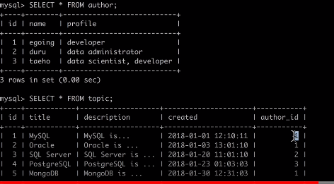
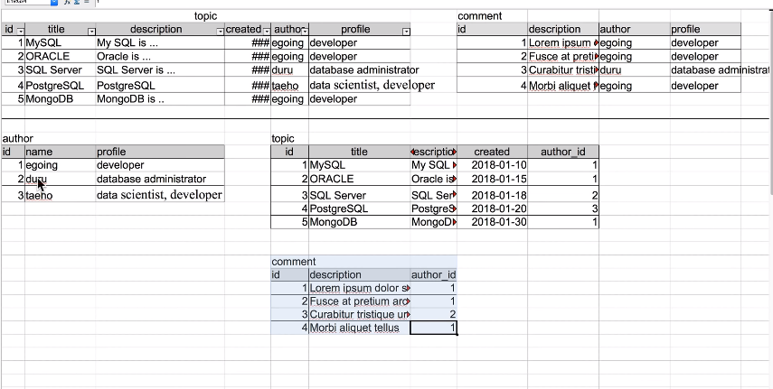

DataBase 복습 1


:cake: MySQL의 구성 요소

- 우리가 데이터를 최종적으로 저장하는 곳은 표(table)임

- 각각의 표들은 기능의 관계에 따라 기하급수적으로 늘어남, 이런 표들은 효율적으로 그룹핑이 되어야함
- database = schema
- table -> database -> database server


:pencil: Database server는 자체적인 보안 체계를 가지고 있음

 - 이외에도 권한 기능을 활용해서 협업 또한 가능함
   	- 권한에 따른 차등 기능 제공등이 가능함


:pen: 수평의 데이터 한 줄 : row, record / 데이터 하나

:pencil2: 수직 데이터 한 줄  : column / 데이터 타입


:pencil:Database 서버에 들어온 후 우리는 schema를 만들어야함

- 데이터 베이스 생성 : <b>CREATE DATABASE <데이터베이스 이름>;</b>
- 데이터 베이스 삭제 : <b>DROP DATABASE <데이터베이스 이름>;</b>
- 데이터 베이스 확인 : <b> SHOW <데이터 베이스 이름>;</b>
- 데이터 베이스 선택 : <b>USE <데이터 베이스 이름>;</b>
- 컬럼 만들기

```SQL
CREATE TABLE topic(
	id INT(11) NOT NULL AUTO_INCREMENT,
    title VARCHAR(100) NOT NULL,
    description TEXT NULL,
    created DATETIME NOT NULL,
    author VARCHAR(15) NULL,
    profile VARCHAR(200) NULL,
    PRIMARY KEY(id)
    
);
```

-  AUTO_INCREMENT : <b>자동증가</b>

- NOT NULL <---> NULL (빈값 비허용 : 허용)
- table의 컬럼 내용 가져오기 : <b>DESC topics</b>
- row 만들기

```SQL
INSERT INTO topic (title,description,created,author,profile) VALUES('MY SQL','My SQL is ...',NOW(),'egoing','developer');
```

- 테이블의 모든 행 출력: <b> SELECT * FROM <테이블명>;</b>
- 만약 테이블에서 특정 컬럼들만 출력하고 싶다면: <b>SELECT <컬럼,컬럼>  FROM <테이블명>;</b> 
- 특정 칼럼값을 갖는 레코드들만 출력하고 싶은경우
  - <b>SELECT <원하는 컬럼들 혹은 *> FROM <테이블명> WHERE <컬렴='값'>;</b>
- 정렬 기능
  - <b>SELECT <원하는 컬럼들 혹은 *> FROM <테이블명> WHERE <컬렴='값'> ORDER BY <컬럼> <정렬순서>;</b> 
  - DESC는 내림차순 정렬
  - ASC는 오름차순 정렬
- 데이터의 몇 건만 보고 싶을 경우
  - <b>SELECT <원하는 컬럼들 혹은 *> FROM <테이블명> WHERE <컬렴='값'> ORDER BY <컬럼> <정렬순서> LIMIT<제한 숫자>;</b>
- SELECT문 추가 <a href="https://dev.mysql.com/doc/refman/8.0/en/select.html">링크</a>
- SELECT문 다중 WHERE <a href="https://inforyou.tistory.com/28">링크</a>


#### UPDATE (수정)

- <b>UPDATE <테이블명> SET <컬럼  명>=<수정하려는 값> 여러개가능하며 ,로 구분 WHERE <바꾸려는 레코드의 위치 컬럼> = <"값"></b>
- WHERE문을 실수로 빠뜨리는 경우 전체 데이터의 값이 변하는 재앙이 발생함..... 조심하자!!!!
- 추가!!!!!
  - 테이블 이름 변경 
    - <B>RENAME TABLE <테이블 명> TO <새로운 이름>;</B>
    - 혹은 <B>ALTER TABLE <테이블 명> TO <새로운 이름>;</B>
  - 다수의 테이블 이름 변경
    - <B>RENAME TABLE <테이블명> to <변경이름1>, <테이블2> to <변경이름2>;</B>
  - 다른 데이터베이스로 테이블 이동
    - <b>RENAME TABLE <데이터 베이스명> to < 이동하려는 데이터 베이스></b>


#### DELETE(삭제)

- <b>DELETE FROM <테이블> WHERE <지우려는 곳의 칼럼과 값></b>


### 관계형 데이터 베이스의 필요성

- 중복되는 데이터들이 발생함 : 개선점이 존재함



- 현재의 상태만으로는 egoing의 값들을 ego++ing으로 바꾸려면 일일이 해야함
- egoing이라는 동명이인이 여러명일 수도 있음
- 등



- author 테이블의 egoing이라는 이름을 가진 record의 이름을 haru로 바꾸기만 하면 모든 egoing의 이름을 한 번만 바꿈으로 나머지 확인 가능
- 또한 동명이인이 존재한다고 하더라도 pk값으로 구분되어짐
- 테이블을 나눌경우 유지보수가 편함, 그러나 테이블의 참조값을 활용하는 형식으로 빠꿀경우 직관적으로 내용을 확인하기가 쉽지않음
  - 그 결과 우리는 나누어진 테이블을 위의 테이블과 같이 하나의 표 형식으로 보고싶음


#### JOIN

- 예시
  - <B>SELECT * FROM topic LEFT JOIN author ON topic.author_id = author.id;</B>
- topic 테이블 생성

```SQL
CREATE TABLE topic(
    ->  id INT(11) NOT NULL AUTO_INCREMENT,
    ->  title VARCHAR(30) NOT NULL,
    ->  description TEXT NULL,
    ->  created DATETIME NOT NULL,
    ->  author_id INT(11) NULL,
    ->  PRIMARY KEY(id)
    -> );
```

- topic 테이블 값 입력 

```SQL
INSERT INTO topic (id,title,description,created,author_id) VALUES(1,'My SQL','My....',NOW(),1);
```

- author 테이블 생성

```SQL
CREATE TABLE author(
    ->  id INT(11) NOT NULL AUTO_INCREMENT,
    ->  name VARCHAR(20) NOT NULL,
    ->  profile VARCHAR(200) NULL,
    ->  PRIMARY KEY(id)
    -> );
```

- author 테이블 입력

```SQL
INSERT INTO author (id,name,profile) VALUES(1,'egoing','developer');
```



- 위의 테이블이 존재하는 경우
- 위의 두 테이블을 결합하기 위한 연결고리는 topic 테이블에서는 author_id  , author 테이블은 id
- author 테이블을 topic 테이블에 붙혀라.
- <b>SELECT * FROM topic LEFT JOIN author ON topic.author_id = author.id;</b>
- <b>SELECT id,title,description,created,name,profile FROM topic LEFT JOIN author ON topic.author_id = author.id;</b>
  - 이 경우에 에러가 발생 topic에도 , author에도 id가 있으므로
  - <b>SELECT topic.id,title,description,created,name,profile FROM topic LEFT JOIN author ON topic.author_id = author.id;</b>
  - 이렇게 id가 무엇의 id인지 정해주면 괜찮
- <b>SELECT topic.id AS topic_id , title,description,created,name,profile FROM topic LEFT JOIN author ON topic.author_id = author.id;</b>
  - AS를 통해서 사람이 보기 쉽게 이름을 변경해줌




중심 래퍼런스

(https://www.youtube.com/channel/UCvc8kv-i5fvFTJBFAk6n1SA)


