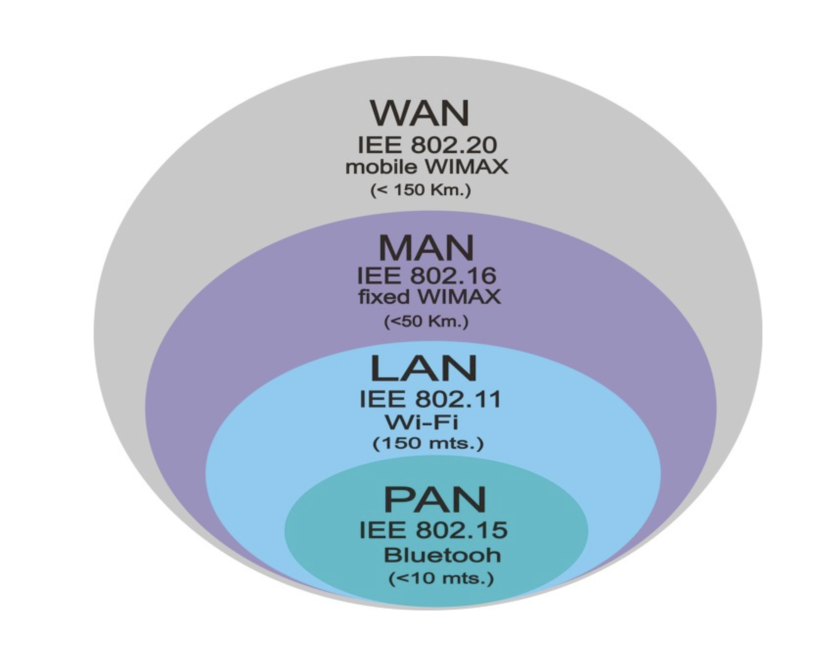

[네트워크 기초 1]

참고 래퍼런스 

(https://musclebear.tistory.com/2?category=773007)

(https://m.blog.naver.com/yeopil-yoon/221286967971)

(https://suhwanc.tistory.com/100?category=781986)

 (https://m.blog.naver.com/PostView.nhn?blogId=neoul0&logNo=120011890773&proxyReferer=https:%2F%2Fwww.google.com%2F)

(1). PC , IP , port -> 이 셋의 차이점은 무엇일까?

- pc : 단독 주택의 집
- ip : 해당 pc의 집 주소
- port : 해당 집으로 들어갈 수 있는 문

#### 집 주소(ip)만을 안다고 해당 집(pc)에 접근할 수는 없다. 해당 집(pc)에 접근하기 위해서는 해당 집의 문(port)을 열고 들어가야한다.

###### `첫 프로젝트를 진행했을때 자바 스프링과 vue.js 프론트엔드간의 rest api 전달 과정에서 발생한 오류의 이유 또한 이 port설정이 제대로 되지 않았기 때문!!!`

(2). bit? byte?란

- bit : 2진수로써 0 or 1의 값을 가짐
- byte : pc는 8개의 bit를 하나의 그룹으로 묶어서 사용한다. 여기서 이 그룹을 (byte)라고 부른다

(2.5). 인터넷이란?

- `수 많은 네트워크들을 연결하는 네트워크` 라는 의미에서 시작되었으며 클라이언트와 서버가 존재하며, TCP/IP라는 기본 프로토콜을 통해 제공되고 있다.
- 인터넷의 구성요소
  - 구조적 관점
    - 1. <b>host</b> : end system이라고도 하며, 연결된 수많은 컴퓨팅 단말기들을 의미한다 (ex. 컴퓨터 , 서버 , 스마트폰 등)
    - 2. <b>link</b> : 위 host들을 연결하는 매개체로 우리가 일반적으 생각하는 광 케이블 , 구리선 등을 의미하며 "`얼마나 빠르게 패킷을 전달하느냐`?"를 의미하는 전송률이 매우 중요하다.
    - 3. <b>packet switch</b> :  패킷(데이터)을 포워딩하는 역할을 하며 대표적으로 라우터와 스위치가 존재함 (포워딩이란 패킷의 헤더정보를 활용해 최종 목적지 네트워크를 향해 패킷을 보내주는 일련의 단계)
  - 서비스적 관점
    - 1. 여러 애플리케이션들의 인프라 구축
    - 2. 여러 애플리케이션들이 상호 연결될 수 있도록 도와줌

(3). 네트워크란?

- 두 대 이상의 컴퓨터들을 연결하고 서로 통신할 수 있는 상태를 의미
- 네트워크는 크기에 따라 네가지의 형태로 나눌 수 있다.

1. PAN : 가장 작은 규모의 네트워크
2. LAN : 근거리 영역 네트워크
3. MAN : 대도시 영역 네트워크
4. WAN : 광대역 네크워크

<b>그러나 현대 네트워크에서 PAN과 MAN은 거의 쓰이지 않는다.</b>

<b>`조그마한 내부 네트워크를 LAN이 통칭하며 WAN은 외부와 통신하는 네트워크 전체를 의미`</b>

(3.5). 네트워크 프로토콜이란?

- 간단하게 표현하면 기계들간의 소통이라고 생각할 수 있음.
- 프로토콜의 양식 안에는 메세지를 전달하는 순서, 취해야할 행동 , 데이터 포맷 등이 존재함

### 1. Network edge, core

​	<b>1-1. 네트워크 코어와 엣지란 무엇인가?</b>

- 네트워크 구조를 자세히 살펴볼 경우 네트워크는 나무와 같이 기둥과 잎이 있는 모양으로 생각할 수 있다.

- 잎 -> 우리가 이용하는 단말기로서 host를 의미함

- 줄기 -> 잎들을 연결시켜주는 link를 의미함

- 기둥 -> 네트워크의 중심점 역할을 하며 뿌리가 어디로 향하느냐에 따라 나무의 방향이 결정되듯, core에서 패킷의 방향을 결정한다. <b>보통 라우터를 network core라고 한다</b>.

  

  <b>1-2. 연결 네트워크 : Dsl</b>

- <b>digital subscriber line</b>의 약자로서 지역 전화망을 통해 디지털 데이터를 전송하는 기술, 보통 높은 주파수를 사용하며, 일반 전화는 낮은 주파수를 사용한다

- <b>upstream</b> : 로컬 기기에서 서버로 데이터를 전송하는 흐름 (<2.5 Mbps)

- <b>downstram</b> : 서버에서 로컬 기기로 데이터를 전송하는 흐름 (<24Mbps)

- 둘의 속도는 <b>비대칭</b>으로 설정되어 있다.

  

  <b>1-3 연결 네트워크 : cable</b>

- 보통 케이블 네트워크는 여러 주파수를 하나의 선에 합치는 다중화 과정을 통해 전송됨

- <b>다중화</b>란

  - 패킷 교환 망에서 통신하고자 하는 모든 호스트들이 동시에 네트워크를 사용하려고 할 경우 네트워크를 어떻게 공유해야할지에 대한 의문이 다중화 작업의 첫 시작점이다.
  - 다중 사용자에 의해 보내진 데이터가 네트워크를 구성하는 물리적 계층위에서 논리적으로 분할(다중화)되어 네트워크를 공유하게 된다.
  - 이렇게 다중화된 패킷의 흐름을 추후에 다시 호스트에게 알맞게 전달하기 위해 복구하는 과정을 역다중화라고 한다
  - 결론적으로 서버 - 호스트 (1:1)관계를 넘어선 , 서버 - 호스트 (1:다)의 관계에서 데이터들이 안정적으로 연결될 수 있도록 하는 과정을 의미
  - 참고 (https://m.blog.naver.com/PostView.nhn?blogId=neoul0&logNo=120011890773&proxyReferer=https:%2F%2Fwww.google.com%2F)

  

  <b>1-4 routing과 forwarding</b>

  

- <b>routing</b>: 출발지에서 목적지 까지의 경로를 결정하는 것을 의미함. 출발지에는 여러가지의 경로가 있는데, 컴퓨터 네트워크에서는 이 중 가장 이득이 되는 경로를 선택하는 과정이 필요하며 <b> routing algorithm</b>을 통해 경로를 계산하고 선택한다.

- <b>forwarding</b>: 라우터의 입력 포트에서 출력 포트로 패킷을 이동시키는 것을 의미함. 앞서 라우팅이 경로를 결정했다면 포워딩은 실제로 데이터를 이동시키는 역할을 한다. 

### 2. Protocol Layer

<b> 2-1. 인터넷 프로토콜 스택</b>

다음과 같이 5계층으로 구성되어있다.

- application : 네트워크 애플리케이션을 지원해준다. ex) HTTP
- transport : 프로세스 간 데이터 전송을 의미함 ex) TCP,UDP
- network : 출발지 - 도착지 간의 라우팅 ex) IP, routing protocol
- link : 주변 네트워크 요소들 사이의 데이터 연결을 지원함 ex) 이더넷 , 와이파이
- physical : 비트들을 선으로 연결한다.

​	<b>2-2. ISO//OSI Model</b>

7개의 계층으로 구성되며, 인터넷 프로토콜 스택에서 2개가 추가된 것이 아니라, 그 이전의 모델이다. 인테넷으는 현재 presentation과 session계층은 사라졌는데, 이 둘은 각각 데이터를 해석해 표현하는 역할, 데이터 변화를 감지하고 체크하는 역할을 담당한다. 현재 이 두 계층은 application 계층에 담겨 있다.

​	<b>2-3. 캡슐화</b>

:cake:<b>캡슐화</b>

- 보내고자 하는 데이터에 필요한 정보(헤더)를 붙여서 다음 계층에 보내는 기술
- 헤더에는 각 계층에서 수행한 정보들이 담겨 있으며, 이후 식별하기 위해 사용된다.
- 윗부분이 캠슐화 과정에 대핟되며, 각 계층을 내려오면서 헤더가 하나씩 추가된다

:pizza:<b>역 캡슐화</b>

- 캡슐화와 정반대되는 개념으로 계층을 지날 때마다 헤더를 제거하는 기술을 의미한다.
- 밑바닥에서 부터 시작되며 application계층에 도달하게 되면 송신자가 보내고자 했던 데이터만 남게 된다.

