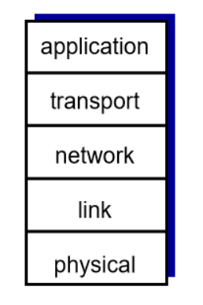
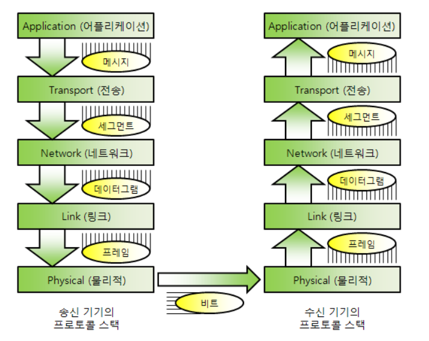
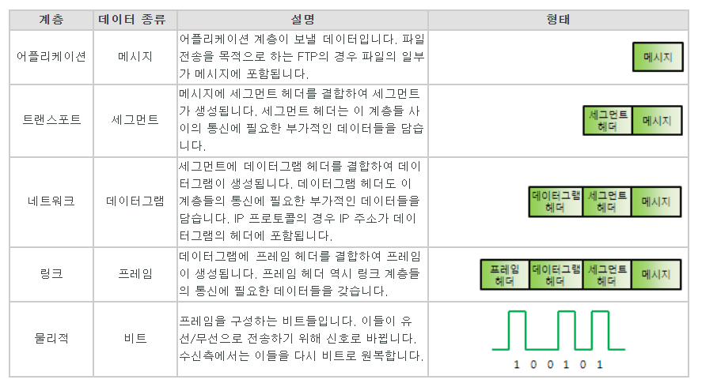
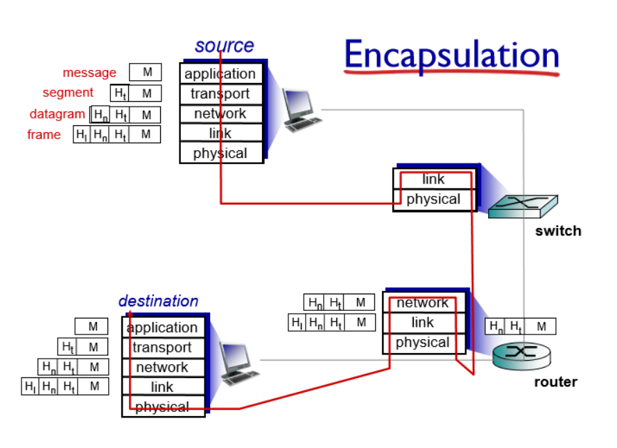
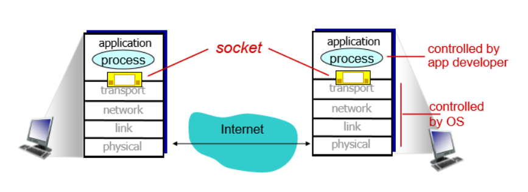

[네트워크 기초2] 


참조 래퍼런스

(https://suhwanc.tistory.com/102?category=781986)

(https://blog.naver.com/netrance/110112688107)


#### 애플리케이션 계층이란?

- 애플리케이션 계층은 컴퓨터 네트워크에서  <b>인터넷 프로토콜과 컴퓨터 네트워크를 통하는 프로세스간 통신 접속을 위해 설계된 추상의 계층</b>
- <b>host (end systems)에서만 작동하는 계층이다</b>


#### 네트워크 어플리케이션 계층의 원리

##### - 네트워크 app의 종류

- 네트워크 app은 <b>단순하게 네트워크를 사용하는 애플리케이션</b>이라고 생각하면 됨
- 우리가 사용하는 모든 유튜브 , 이메일등이 네트워크 app에 해당된다.

##### - 인터넷 프로토콜 스택







1. <b>application layer</b> : 애플리케이션 계층은 프로그램이 실제로 구현할 수 있는 프로토콜을 제공하며 인터넷 프로토콜 스택의 최상단 개념이다. (FTP, SMTP , HTTP등이 존재한다.)
2. <b>transport layer</b> : 실제로 데이터를 전송시키는 역할을 함 (TCP, UDP가 해당됨)
3. <b>network layer</b> : <b>데이터 그램</b>을 출발지에서 목적지로 라우팅하는 역할을 한다. (ip , 라우팅 프로토콜 등이 존재)
4. <b>link layer</b> : 이웃 네트워크 끼리 데이터를 전송하는 역할을 한다. (이더넷 , 와이파이)
5. <b>physical layer</b> : 선으로 비트를 연결해주는 역할을 한다


(추가) OSI 7계층에는 presentation계층과 session계층이 존재하지만 현실에서 두 계층은 application 계층에 거의 흡수됨  


##### - 캡슐화와 역 캡슐화



<b>캡슐화</b> 

- 애플리케이션 계층에 있는 메시지<b>(원본 데이터를 보내기 쉽게 쪼갠 메시지)</b>가 각 계층을 거치면서 추가적인 헤더를 붙는 과정. 이떄 각 계층마다 정해진 헤더가 붙는다.

- 각 계층멸 헤더

  - application layer -> message
  - transport layer -> segment
  - network layer -> datagram
  - link layer -> frame

  <b>이렇게 분류된 헤더를 PDU(Protocol Data Unit)이라고 한다.</b>

<b>역 캡슐화</b>

- 캡슐화 과정에서 붙인 헤더들을 토대로해서 데이터 분류 및 헤더 제거과정을 한다.


##### - 애플리케이션 구조

애플리케이션 구조는 크게 client-server구조와 peer - to - peer 구조가 존재함.

<b>(1) 클라이언트 서버 구조</b>

- 서버
  - 언제나 연결되어 있어야한다 ("always-on")
  - ip주소르르 영구적으로 가져야한다.
  - 규모에 따라 데이터센터의 크기가 변화한다.
- 클라이언트
  - 서버를 통해서만 소통한다 (다른 클라이언트 끼리는 연결이 불가능하다.)
  - 가끔 연결된다 (무상태성과 , 무연결성을 의미함)
  - 유동적인 IP주소를 갖는다

<b>(2) P2P 구조</b>

Peer - to - Peer구조는 복합적인 시스템으로 사용자가 모두 peer이며 서버와 클라이언트 모두의 역할을 한다.

- 항상 켜져 있을 필요는 없음
- 소통시 무작위 연결
- 자가확장성을 가짐 : 피어가 많아질 수록 성능이 좋아짐 (약간 블록체인 느낌??)
- IP가 바뀔 수 있다.


##### - 프로세스

프로세스는 호스트(end system) 내에서 애플리케이션 레이어를 작동시키는 것을 의미한다.

즉, " 실행되고 있는 프로그램을 <b>프로세스</b>"라고 한다.

프로세스는 어디서 작동되느냐에 따라서 단어가 달라진다.

- client process : 클라이언트 프로세스로 주로 서버에 무언가를 요청한는 것을 말한다.
- server process: 서버 내의 프로세스로 주로 클라이언트의 요청을 기다리는 것을 의미한다.
- p2p process는 두가지의 역할을 모두 한다.


프로세스는 같은 호스트 내에서 통신할 수도 있으며 서로 다른 호스트 내부의 프로세스에서도 메시지를 주고 받을 수 있음

`추가`

```txt
서로 다른 프로세스끼리 데이터를 전달하기 위해 `소켓`이라는걸 사용해야한다.

ssafy 프로젝트에서 비동기적 통신을 하기위해서 socket을 사용했던 경험이 있다.
```


##### - socket(소켓)



소켓의 위치는 application layer와 transport layer사이에 존재하며 os에 의해서 컨트롤 된다.

서로다른 프로세스간의 요청 및 응답을 위해서 네트워크 통신을 위한 프로그램들은 소켓을 생성하고 이 소켓을 통해서 서로 데이터를 교환한다.


블로그의 글에는 `즉, 우체통처럼 데이터를 소켓에 넣으면 우체부가 소켓에 있는 데이터를 가져간다고 보면된다`. 라고 표현되어 있는데 진짜 완전 나이스한 표현인것 같다.


##### - 주소 처리법

메시지를 받기위해 각각의 프로세스는 각자만의 id를 가지고 있어야하며 이 아이디는 ip의 주소와 포트번호로 구분된다.


- <b>ip</b> 
  - ip는 호스트 디바이스가 갖는 32비트짜리 주소로 우리가 흔히 알고있는 ip주소를 의미한다.
- 많은 프로세스는 같은 호스트 내에서 동작하기 때문에 같은 ip주소를 사용하는 경우가 많다
- <b>포트번호</b> 
  - 포트번호는 데이터를 받을 프로세스를 식별하게 해주는 역할을 하며 16비트 짜리 정수이다.
  - 보통 HTTP서버는 80번, 메일 서버는 25번등의 고유번호를 가지고 있다
  - <b>개인적인 생각</b>으로 ip는 내가 가진 스마트폰을 의미하고 포트는 스마트폰에 깔린 각기 다른 앱을 의미하는 것 같다.


##### - 애플리케이션 레이어 프로토콜

- 애플리케이션 레이어 프로토콜은 다음과 같은 정보들을 가지고 있다.
  - 무슨 명령인지 (요청인지 , 응답인지)
  - 문법 (메세지의 내용)
  - 의미(출발 및 도착지 ip, 포트번호)


##### - 애플리케이션 레이어가 기대하는 transport layer의 역할

- 애플리케이션과 트랜스포트 레이어는 서로 붙어있으며 상호작용 하기 때문에 서로 도와야한다.
- 이에 따라 애플레케이션 레이어가 기대하는 트랜스포트 레이어의 역할들이 존재한다.
  - 데이터 보전
    - 데이터가 손실없이 전송되기를 바란다.
    - 하지만 이러한 사항은 애플리케이션의 종류에 따라 나뉘는데 메일이나 웹 통신은 100%의 신뢰성을 요구하지만, 오디오 등은 어느정도의 손실을 허용한다.
  - 타이밍
    - 적은 딜레이로 데이터를 주고 받아야한다.
  - 처리량
    - 실시간 전송량을 의미함, 멀티미디어의 경우 최소 이정도의 전송량에 대한 최소 조건이 있지만 문서의 경우 느려도 괜찮다
  - 보안