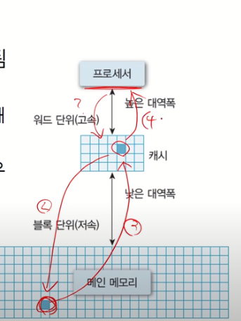
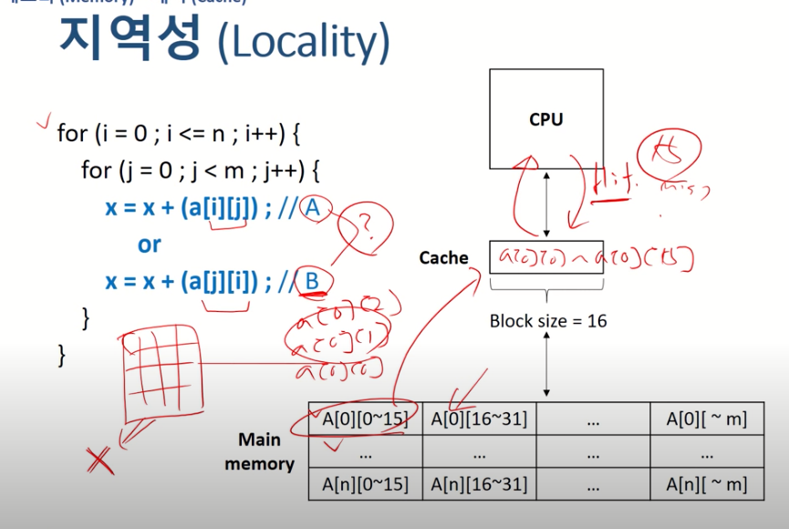
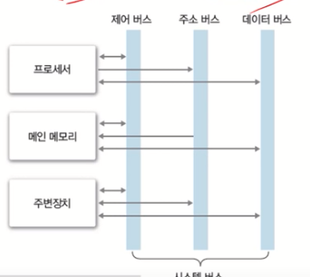
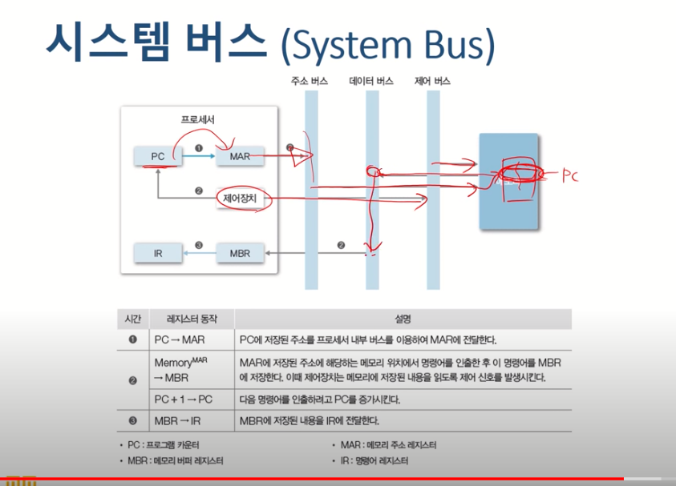

[운영체제 : 정리1]

(본 자료는 한국 기술 교육 대학교 , 김덕수 교수님의 강의를 바탕으로 직접 정리 하였습니다.)

(https://www.youtube.com/playlist?list=PLBrGAFAIyf5rby7QylRc6JxU5lzQ9c4tN)

(https://sites.google.com/view/hpclab/courses/operating-system)

강의에 사용된 슬라이드나 영상 내용이 너무 많아 전부 정리하기 보다는 제가 영상을 보면서 이해가 쉽지 않았던 부분을 중점적으로 정리하였습니다.

#### 프로세서

- 레지스터 : 컴퓨터에서 가장 빠른 메모리 , 프로세서가 사용할 데이터 저장
- 운영체제는 프로세서를 관리한다.
- 프로세서에게 프로세스 생성 및 관리를 시킨다 (운영체자가)
- 프로세서 사용 시간 관리 및 복수 프로그램간 사용시간을 조율 해줌

#### 메모리

- 데이터를 저장하는 장치(프로그램 , 사용자 데이터 등)
- 레지스터 - 캐시(cpu) - 메인 메모리(ram) - 보조 기억장치(하드디스크)
- 왼쪽으로 갈 수록 속도가 빨라지며 가격은 비싸짐 , 그러나 용량은 작아짐
- :heavy_check_mark:주 기억장치 : 메모리
  - 프로세서가 수행할 프로그램과 데이터는 반드시 메인 메모리안에 들어가 있어야 한다.
  - 프로세서가 직접 접근할 수 있는 범위는 메인 메모리 까지 이다.
  - 왜 프로세서는 디스크로 바로 접근하지 않을까?
    - 디스크 발전에 비해 CPU의 속도 발전이 디스크의 속도 발전보다 너무 빠르게 발전했기 때문에 그래서 CPU와 디스크 사이의 속도차이를 가운데에서 적당히 조절해 주기 위해서 CPU보다는 느리지만 디스크보다는 빠른 메모리를 둘 사이에 놓음
- :heavy_check_mark: 캐시
  - 프로세서 내부에 있는 메모리
  - 레지스터는 캐시보다 CPU 중심에 더욱 가까이 있음
  - 캐시가 존재하는 이유?
    - 메인 메모리와 CPU 사이의 속도 차이를 다시 한 번 줄이기 위해 메인 메모리보다는 빠르지만 메인 CPU보다는 느린 캐시를 가운데에 위치 시킴 (L1,L2 캐시등 다양하게 존재)
    - 메인 메모리의 병목 현상 해결
  - 캐시의 동작 과정
    - 일반적으로 HW가 관리함
    - 프로세서가 먼저 캐시에게 가서 프로세서가 원하는  데이터가 있는 지 묻고 있으며 캐시에서 가져다 쓰지만 없을 경우 메인 메모리에서 가져온다
    - 캐시 히트 : 필요한 데이터 블록이 캐시에 존재
    - 캐시 미스 : 필요한 데이터 블록이 캐시에 없는 경우
    - 캐시 히트를 통해 과연 효과를 볼 수 있을까? (캐시히트의 크기가 매우 작은데)
    - 하지만 효과를 볼 수 있는 이유!!!
      - 지역성
        - 공간적 지역성 -> 어떤 주소를 참조할 경우 우리는 아마도 그에 인접한 주위 주소를 참조할 것이라는 특성
        - 시간적 지역성 -> 한 번 참조한 주소를 우리는 다시 참조할 가능성이 매우 크다
        - 지역성은 캐시 적중률과 밀접하다. 
        - 캐시라인(블록의 크기) -> 캐시는 가져올때 자신 주위의 몇개의 블록을 더 가져온다.
        - A와 B를 비교 해 보았을때 B는 캐시미스가 계속 발생하지만 A는 캐시히트가 자주 발생한다. 같은 for문이여도 순서에 따라 엄청난 효율성 차이가 발생함

- :heavy_check_mark:보조 기억 장치
  - 프로그램과 데이터를 저장함
  - 프로세서가 직접 접근할 수 없다. 그러므로 주변장치로 분류됨
  - 우리는 그래서 보조기억장치의 데이터를 쓰고 싶을 경우 메모리에 올려놓아야함.
  - 하려는 게임이 20gb인데 메모리가 8gb이다. 근데 이게 가능해?
    - 이를 해결하기 위해 가상메모리 개념이 활용됨 (8장에서 다룸)

- :heavy_check_mark: 시스템 버스
  - 하드웨어들이 데이터 및 신호를 주고 받는 물리적인 통로
  - 장치들이 통신을 하는 통로 (다양한 버스들이 존재함, 제어버스 , 주소 버스 , 데이터 버스)

- :heavy_check_mark:주변장치
  - 장치 드라이버 : 추가 주변장치 사용을 위한 인터페이스 제공
  - 입력이 들어옴을 알려주는 장치 : 인터럽트
  - 파일 및 디스크 관리

