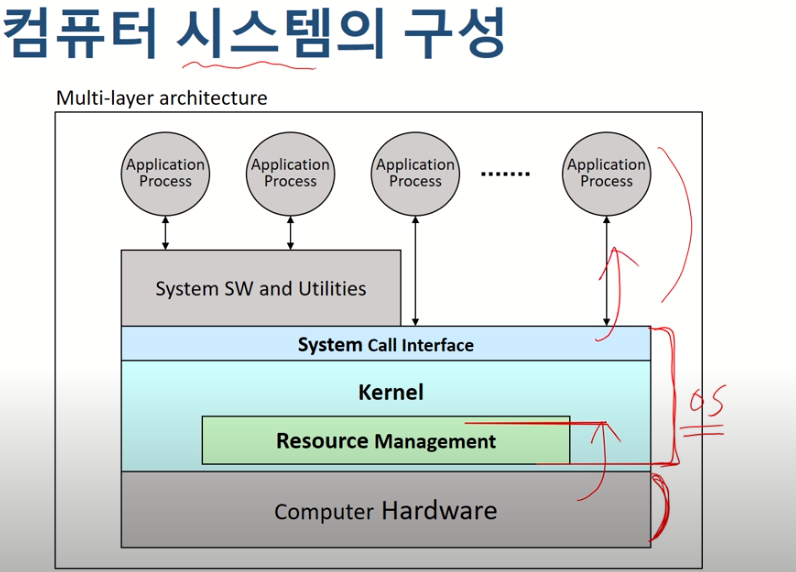
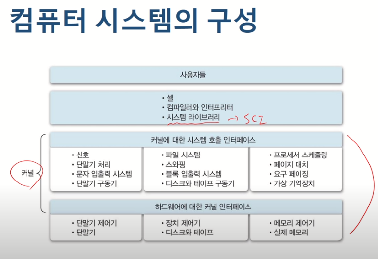
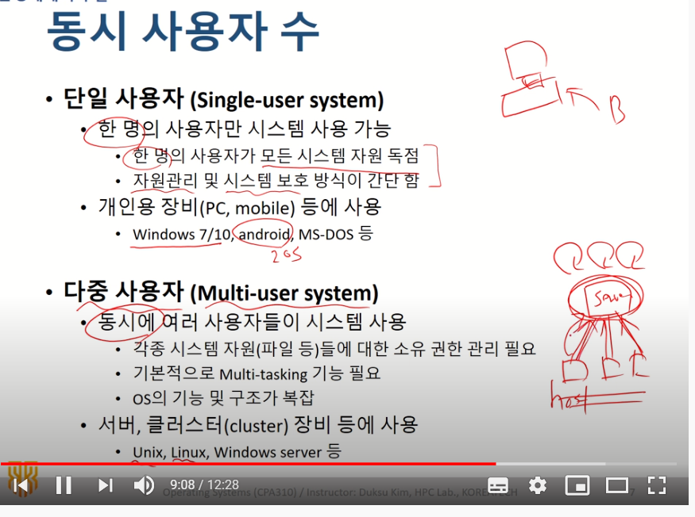
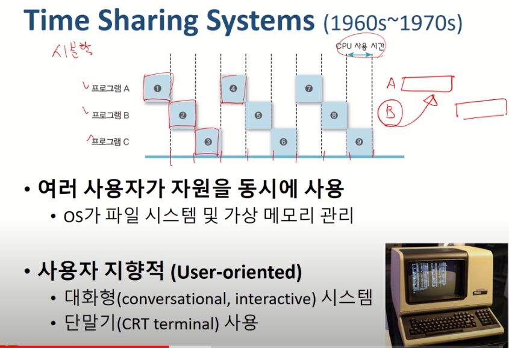
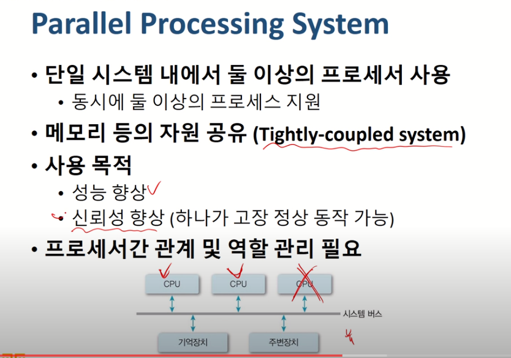
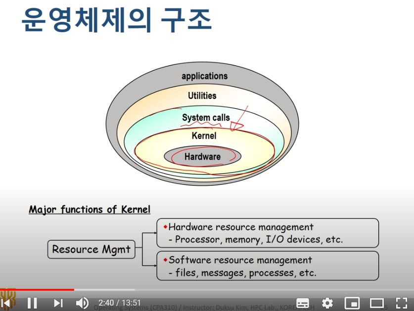
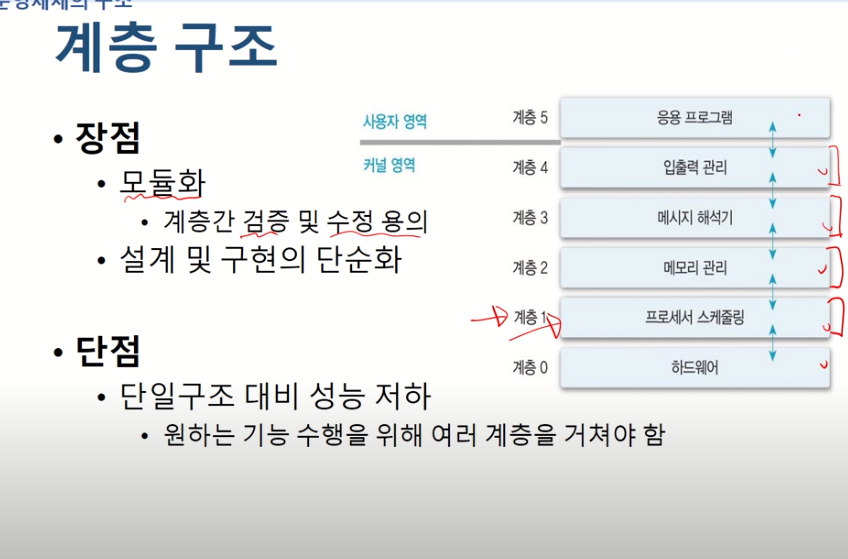
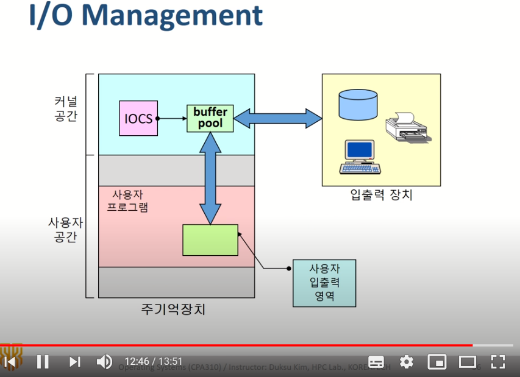

[운영체제 : 정리2] 2~4

(본 자료는 한국 기술 교육 대학교 , 김덕수 교수님의 강의를 바탕으로 직접 정리 하였습니다.)

(https://www.youtube.com/playlist?list=PLBrGAFAIyf5rby7QylRc6JxU5lzQ9c4tN)

(https://sites.google.com/view/hpclab/courses/operating-system)

2021.03.17에 작성

운영체제

- 컴퓨터 하드웨어를 효율적으로 관리해서 응용 프로그램 및 사용자에게 효율적으로 서비스를 제공
- 역할
  - User Interface(편리성)
    - 사용자가 손쉽게 사용할 수 있도록 도와줌
    - CUI (문자 중심)
    - GUI (그림 중심)
    - EUCI (특정 목적)
  - Resoucre Management(효율성)
    - 자원관리 (하드웨어 및 소프트웨어의 자원을 효율적으로 관리한다.
  - Process and Thread management
  - System management(시스템 보호)
- 
- 사용자가 커널에 직접적으로 엑세스 한다면 커널이 hw를 제어하는 데 문제를 일으킬 수 있음
- 그래서 우리는 커널에 직접적으로 접근하지 않고 system call interface를 통해서 커널에 접근함
- 

- 운영체제의 구분

  - 동시 사용자 수

    - Single-user system : 우리가 흔히 사용하는 윈도우 (동시에 한 명만 사용가능)
    - Multi-user system : Unix, Linux, Windows server : 동시에 여러 사용자들이 시스템 사용, 서버 , 클러스터 장비등에 사용

- 
- 동시 실행 프로세스 수
  - 단일 작업
    - 한 번에 하나의 프로그램만 실행가능
    - ex. ms-dos
  - 다중 작업
    - 동시에 여러 작업(프로세스)의 수행 가능
      - 작업들 사이의 동시 수행, 동기화 등을 관리해야함
    - 운영체제의 기능 및 구조가 복잡
      - ex. Unix/Linux, Windows 등

​    

- 작업 수행 방식

  - 1. 순차 처리 ( ~ 1940s)

       - 운영체제라는 개념이 존재하지 않았음

       - 사용자가 기계어로 모든 프로그램을 작성했어야 함

       - 실행하는 작업은 순차적으로 이루어짐 (각각의 작업에 대해 준비 시간이 필요)

         - 예를들자면 컴퓨터를 어떤 언어로 짰는지에 따라 세팅하는데 오랜 시간이 걸림

       - Batch system

         - 모든 시스템을 중앙에서 관리 및 운영

         - 사용자의 요청 작업을 일정시간 모아 두었다가 한 번에 처리 (일괄처리)

           ->	이를 통해 전환에 소요되는 시간을 줄임

         - 시스템 지향적

           - <b>장점</b>
    - 많은 사용자가 시스템 자원을 공유
           - 처리의 효율성이 향상됨
    - <b>단점</b>
           - 생산성 저하
    - 긴 응답시간
      
    2. Time Sharing System (1960 ~ 1970s)

       - 시분할 시스템 ( 현대의 대부분 시스템이 이방식으로 구성됨 )
       - 
       - 여러 사용자가 자원을 동시에 사용
         - os가 파일 시스템 및 가상메모리 관리에 대한 개념이 등장
       - 사용자 지향적
         - 대화형 시스템
         - 단말기 사용
         - <b>장점</b>
         - 응답시간 단축
         - 생산성 향상
         - <b>단점</b>
         - 통신 비용 증가 + 보안 문제
         - 개인 사용자 체감 속도 저하
           - 동시 사용자 수 증가 -> 시스템 부하 -> 느려짐 

    3. Personal computing

       1. 개인이 시스템 전체 독점
       2. cpu활용률이 고려의 대상이 아니게 바뀜
       3. os가 상대적으로 단순함
          - 하지만, 다양한 사용자 지원 기능이 등장
       4. 장점
          - 빠른 응답시간
       5. 단점
          - 성능이 낮음

    4. 병렬처리 시스템

       - 단일 시스템 내에서 둘 이상의 프로세서 사용
       - 메모리 등의 자원 공유
       - 사용목적
         - 성능향상
         - 신뢰성 향상
       - 프로세서간 관계 및 역할 관리 필요

​             

- Distributed Processing systems
  - 네트워크를 기반으로 구축된 (컴퓨터 여러대를 묶은) 병렬처리 시스템
  - 물리적인 , 통신망 이용한 상호연결
  - 각각의 노드 (붙은 컴퓨터)들은 분산운영체제를 통해 하나의 프로그램처럼 사용가능
  - 예) 슈퍼컴퓨터 , p2p 등
  - 장점
    - 자원 공유를 통한 높은 성능
    - 고 신뢰성(하나의 cpu가 고장나도 다른 애로 해결), 높은 확정성
  - 단점
    - 구축 및 관리가 어려움

- Real-Time Systems (실시간 시스템)
  - 작업 처리에 제한 시간을 갖는 시스템
  - 제한 시간내에 서비스 결과를 제공하는 것이 자원 효율성보다 중요
  - Hard real-time task
    - 시간 제약을 지키지 못하는 경우 시스템에 치명적인 영향을 미침
    - 예시 - 발전소 제어, 무기 제어 등
  - Soft real-time task
    - 동영상 재생 등

- 운영체제의 구조
  - 커널 (Kernel)
    - os의 핵심 부분(메모리 상주)
    - 가장 빈번하게 사용되는 기능들을 담당
      - processor, memory 등
      - 커널은 항상 메모리에 올라가 있음
    - 핵, 관리자, 상주프로그램, 제어프로그램이라는 동의어로도 불림
  - 유틸리티(utility)
    - 비상주 프로그램
      - 필요할때 마다 메모리에 올려서 실행함
    - ui등 서비스 프로그램
- 

1. 단일체제 운영구조
   - 하나의 커널안에 모든 기능들이 들어가 있는 구조
   - 장점
     - 기능들간의 소통이 매우 편하고 빠름
   - 단점
     - 커널의 거대화
       - 오류 및 버그 , 추가 기능 구현등 유지 보수가 어려움
       - 동일 메모리에 모든 기능이 있어, 한 모듈의 문제가 전체 시스템에 영향

그래서 !!!!

2. 계층구조 운영구조
   - 기능별로 모듈화 시킨 커널
   - 설계 및 구현의 단순화
   - 그러나 단일 구조 대비 성능이 저하됨
   - 
3. 마이크로 커널 구조
   - 커널에는 진짜 필수기능만 담고, 나머지는 사용자의 영역에서 응용프로그램처럼 실행하자.

- 운영체제의 기능
  - 프로세스 관리
  - 프로세서 관리
  - 메모리 관리
  - 파일 관리
  - 입출력 관리
  - 보조기억 장치 및 기타 주변 잔치 관리 등

- 프로세스
  - 커널에 등록된 실행단위 (실행중인 프로그램)
  - 사용자 요청 / 프로그램의 수행 주체
- os의 프로세스 관리 기능
  - 생성/삭제 , 상태 관리
  - 자원할당
  - 프로세스 간 통신 및 동기화
  - 교착상태 해결
  - 프로세스 정보 관리

- 프로세서
  - 중앙처리 장치(cpu)
  - 프로그램을 실행하는 핵심자원
- 프로세스 스케줄링
  - 시스템 내의 프로세스 처리 순서 결정
- 프로세서 할당관리
  - 어떤 프로세스에게 자원을 줄지

- 메모리
  - 주 기억장치
    - 작업을 위한 프로그램 및 데이터를 올려놓는 공간
  - 멀티유저 , 멀티 테스킹 시스템
    - 프로세스에 대한 메모리 할당 및 회수
    - 메모리 여유 공간 관리
    - 각 프로세스의 할당 메모리 영역 접근
  - 메모리 할당방법 

- 파일
  - 논리적 데이터 저장 단위
  - 사용자 및 시스템의 파일 관리
  - 디렉토리 구조 지원
  - 파일 관리 기능

- 입출력 과정
  - 입출력 장치와 프로세스가 만나기 위해서는 반드시 os를 거쳐야함
  - 

- 그외에도 
  - 디스크
  - 네트워크 
  - 보안 등 다양한 기능 수행