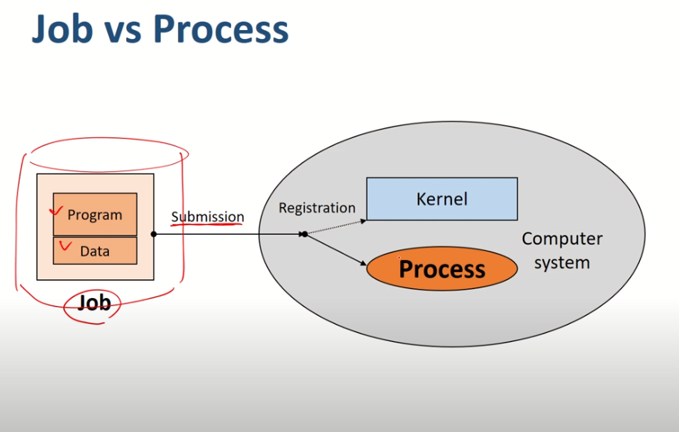
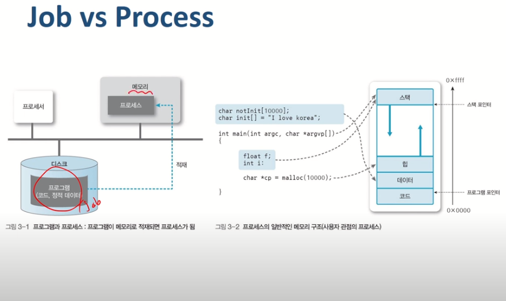
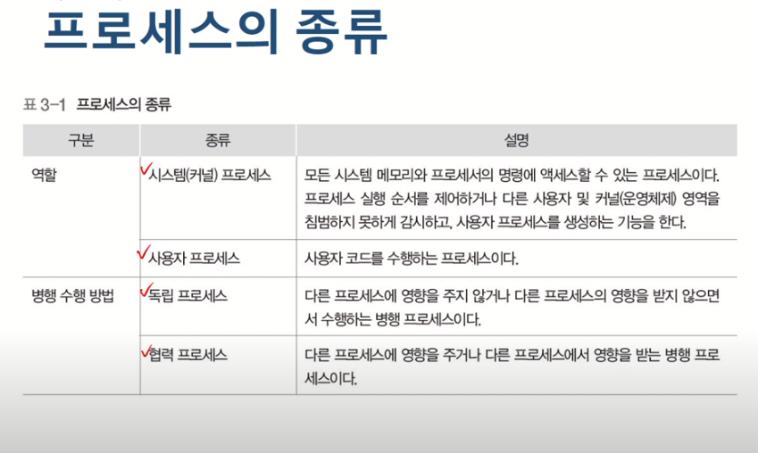
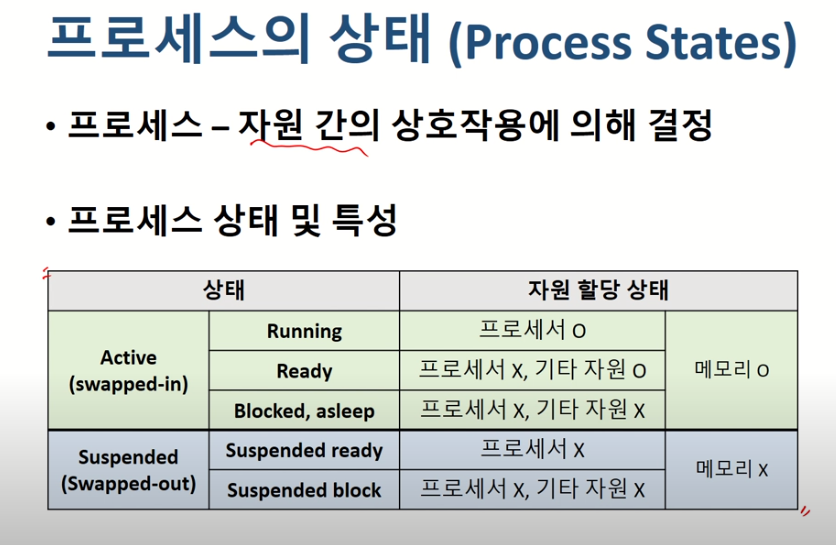
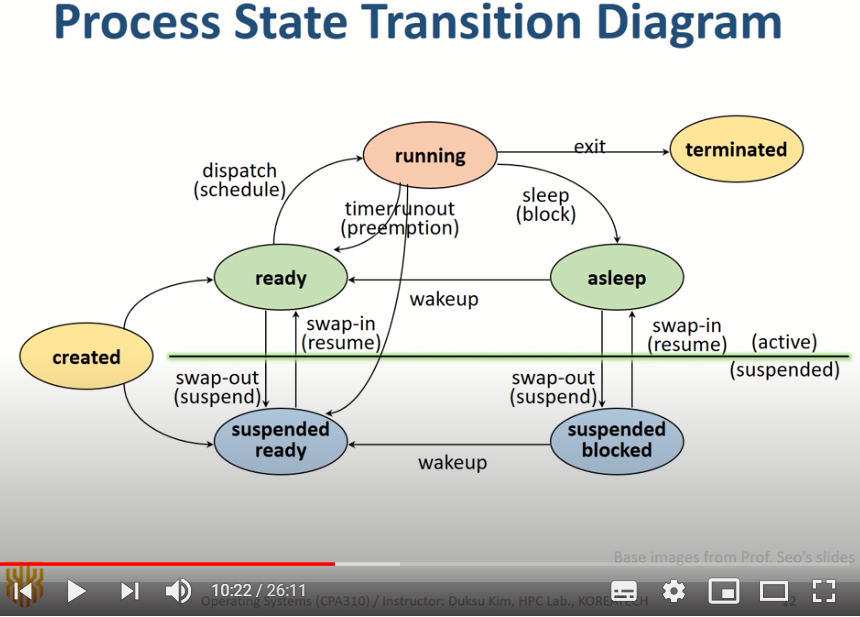

[운영체제 : 정리3] 5~6 

(본 자료는 한국 기술 교육 대학교 , 김덕수 교수님의 강의를 바탕으로 직접 정리 하였습니다.)

(https://www.youtube.com/playlist?list=PLBrGAFAIyf5rby7QylRc6JxU5lzQ9c4tN)

(https://sites.google.com/view/hpclab/courses/operating-system)

### 프로세스 관리

- 작업 (job) / 프로그램 (program)
  - 실행 할 프로그램 + 데이터
  - 컴퓨터 시스템에 실행 요청 전의 상태
- 프로세스 (process)
  - 실행을 위해 시스텀(커널)에 등록된 작업
  - 시스템 성능 향상을 위해 커널에 의해 관리됨

- 프로세스의 정의
  - 실행중인 프로그램
    - 커널에 등록되고 커널의 관리하에 있는 작업
    - 각종 자원들을 요청하고 할당 받을 수 있는 개체
    - 프로세스 관리 블록을 할당받은 개체
    - 능동적인 개체
  - process control block(PCB)
    - 커널 공간 내에 존재
    - 각 프로세스들에 대한 정보를 관리

- 프로세스의 종류

### 자원의 개념

- 커널의 관리하에 프로세스에게 할당/반납 되는 수동적 개체
- 자원 <  ---- (커널) ----- > 프로세스
- 하드웨어 자원과 , 소프트웨어 자원등으로 나눌 수 있음

- Process Control Block(PCB)
  - OS가 프로세스 관리에 필요한 정보 저장
  - 프로세스 생성 시 , 생성 됨
  - 프로세스가 하나 생성되었다 -> 즉 커널에 PCB가 생성되었다를 의미함
  - 메모리에는 커널의 영역이 존재하며 커널안에 PCB가 존재
  - PCB가 관리하는 정보
    - PID
    - 스케줄링 정보
    - 프로세스 상태
    - 메모리 관리 정보
    - 입출력 상태 정보
    - 문맥 저장 영역 (context save area)
    - 계정 정보
  - PCB는 OS별로 서로 다름
  - PCB의 참조 속도는 OS의 속도르르 결정하는 중요한 요소

- 프로세스의 상태
  - 프로세스 - 자원간의 상호작용에 의해 결정

- 프로세스 전송 다이어그램

- created state
  - 작업을 커널에 등록
  - pcb 할당 및 프로세스 생성
  - 커널
    - 가상 메모리 공간 체크 및 프로세스 상태 전이 과정을 통해 created된 프로세스가 ready로 갈지 suspended ready로 갈지 정의됨
    - 메모리가 있다면 ready , 없다면 suspended ready
- ready state
  - 프로세서 외에 다른 모든 자원을 할당 받은 상태
    - 프로세서 할당 대기 상태
    - 즉시 실행 가능 상태
    - 프로세서 (cpu)
  - Dispatch (or Schedule)
    - ready state -> running state
- running state
  - 작업을 실행중인 상태 + 프로세서도 할당 받음
  - 이 상태를  벗어나는 경우
  - 1. ready로 내려가는 경우
       -  프로세서를 빼앗기는 경우 (preemption)
       - 프로세서 스케줄링 이나 타임슬롯에 의해서 발생
    2. asleep상태로 가는 경우
       - 은행에 갔는데 필요한 서류를 가져오지 않은 경우 -> 나는 서류를 가져오는 동안 잠시 은행 내 창구를 대기시켜두는 것을 의미함