[운영체제 : 정리4] 7 

(본 자료는 한국 기술 교육 대학교 , 김덕수 교수님의 강의를 바탕으로 직접 정리 하였습니다.)

(https://www.youtube.com/playlist?list=PLBrGAFAIyf5rby7QylRc6JxU5lzQ9c4tN)

(https://sites.google.com/view/hpclab/courses/operating-system)

#### 스레드 관리

- 프로세스와 스레드
  - 프로세스 : 자원을 할당받고 자원을 제어하여 작업을 수행하는 과정
- 할당과 제어의 과정 중 제어의 과정만 분리한걸 "스레드"라고 말함
- 스레드는 여러개가 존재 가능

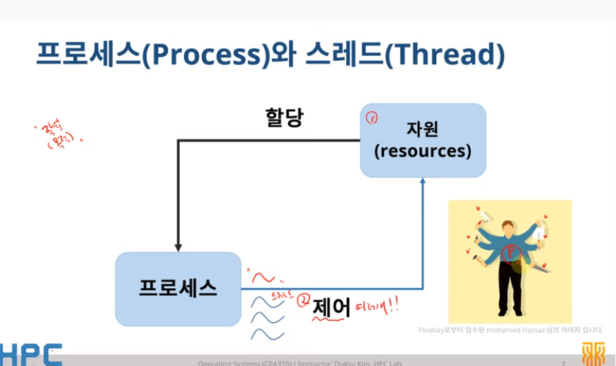

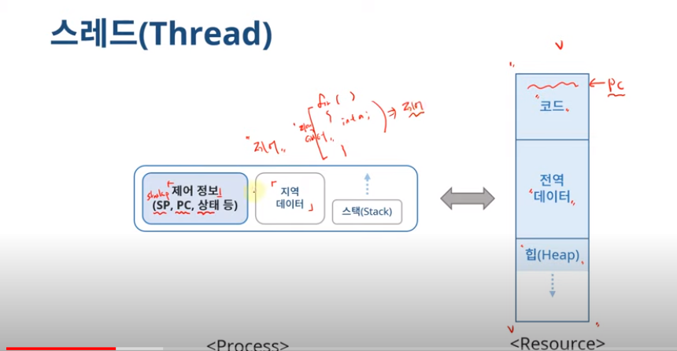

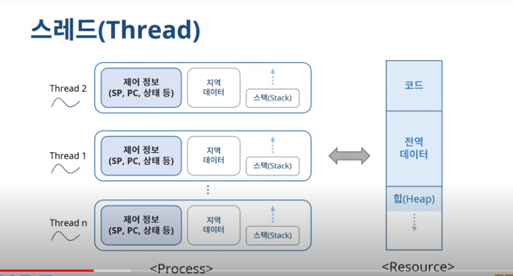

- 하나의 프로세스 안에 여러개의 스레드가 존재가능
  - 각각의 기능을 제어함

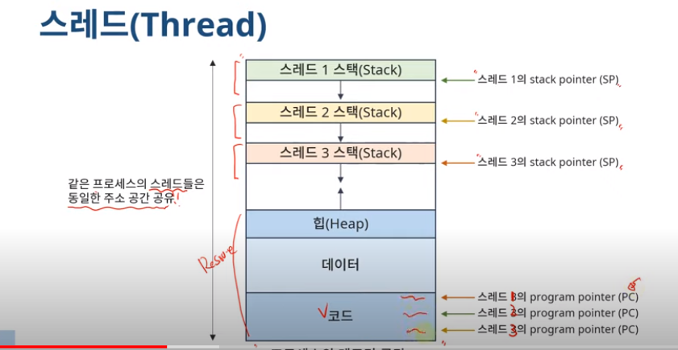

- 스레드
  - Light Weight Process(LWP)
  - 원래 프로세스는 자원과 제어를 모두 가져야하는데 , 스레드는 자원은 공유하고 제어부분만을 가지고 있기 때문에
  - 프로세서(EX,CPU) 활용의 기본 단위
  - 구성요소
    - Thread Id
    - register set
    - stack
  - 제어 요소 외 코드, 데이터 및 자원들은 프로세스 내 다른 스레드들과 공유
  - 전통적 프로세스 = 단일 스레드 프로세스

- 단일 스레드 프로세스 vs 멀티 스레드 프로세스

- 스레드의 장점
  - 사용자 응답성
    - 일부 스레드의 처리가 지연되어도, 다른 스레드는 작업을 계속 처리 가능
  - 자원 공유
    - 자원을 공유해서 효율성 증가 (커널의 개입을 피할 수 있음)
      - 1번 프로세스와 2번 프로세스 모두 a라는 자원을 사용할때 1과 2는 a를 번갈아 가며 사용함 -> context swirching이 발생
      - 그런데 만약 프로세스가 아닌 1번 스레드와 2번 스레드라면 a를 동시에 사용할 수 있음, 하나의 프로세스 내에서 발생하기 때문에 context switching이 발생하지 않음
  - 경제성
    - 프로세스의 생성 , context switch에 비해 효율적
  - 멀티 프로세서 활용
    - 스레드가 여러개 라는 점은 더 많은 cpu 코어를 사용할 수 있음
    - 병렬처리를 통해 성능 향상

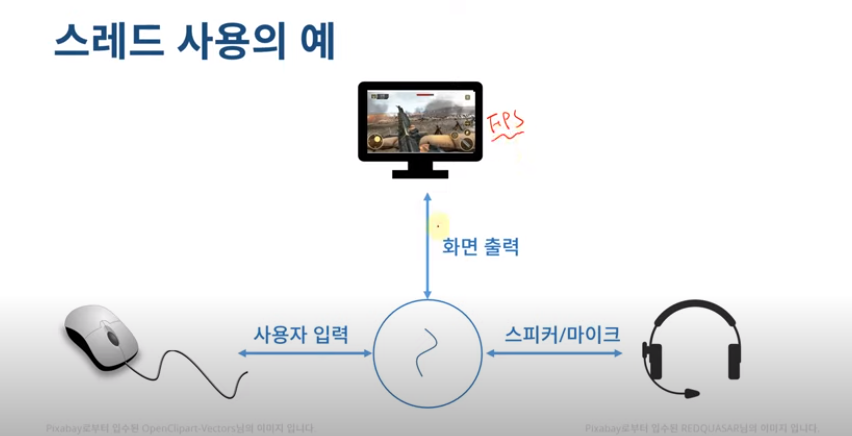

- 스레드가 하나 일 경우 각각의 작업을 위해 context swiching등의 과정이 계속 발생
- 그러나 스레드가 여러개일 경우 각 작업들이 동시에 이루어질 수 있음 
  - (배그라는 게임의 프로세스 내에 마우스 이동 , 화면 송출 , 음성 채팅 등의 역할을 하는 스레드들이 존재)
- 사용자의 응답성이 증가함
  - 마우스 클릭이 지연되더라도 화면은 안 끊기고 나오고, 소리도 안 끊김

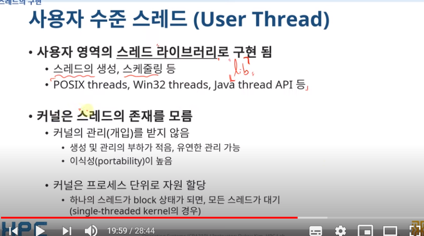

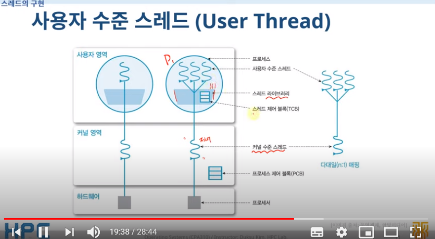

- 커널의 개입이 없고 라이브러리 단계에서 작동함으로 "오버헤드"가 적음
- 커널 수준의 스레드는 하나인데 사용자 수준에서는 여러개인 상태
- 하나의 유저 상태의 스레드가 블록상태가 되면 다른 유저 상태의 모든 스레드가 기다려야함
  - 커널은 프로세스 별로 자원을 할당하기 때문에

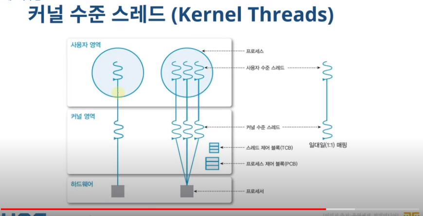

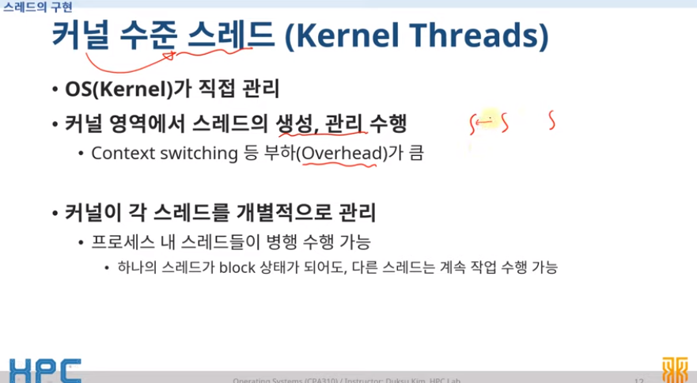

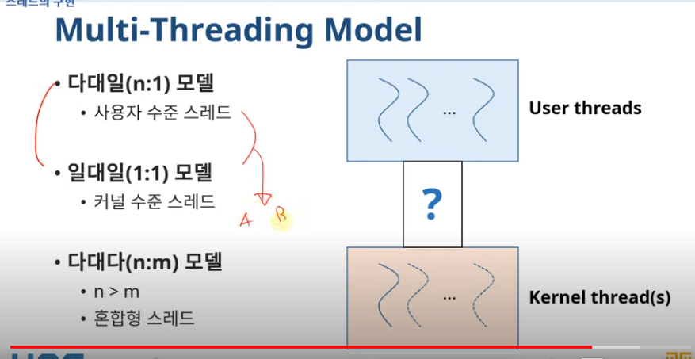

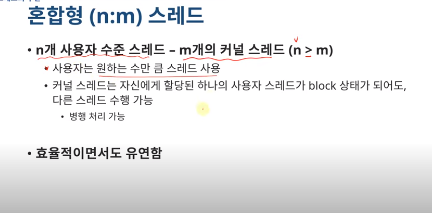

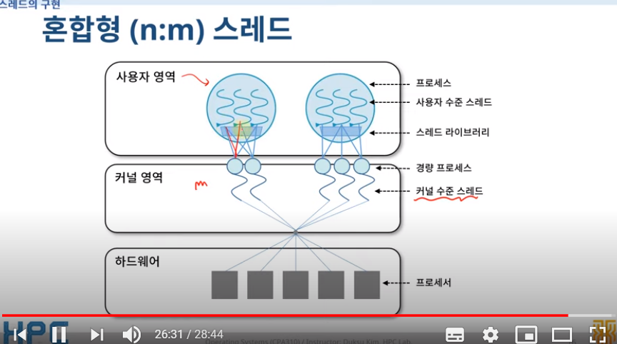

