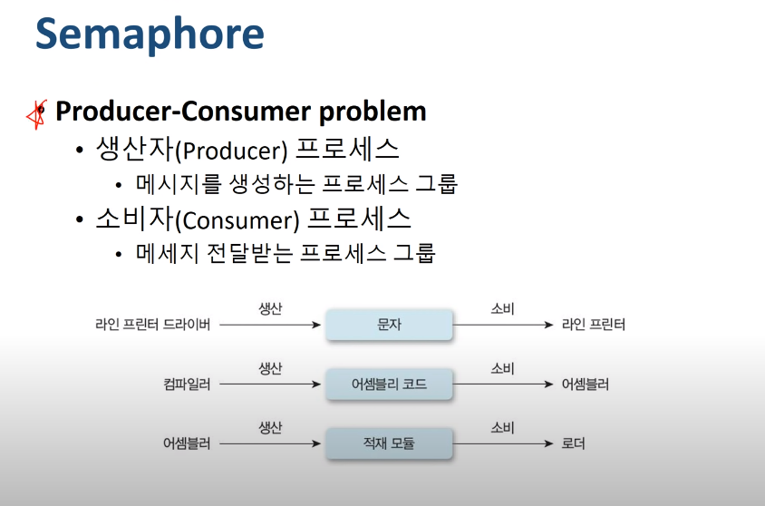
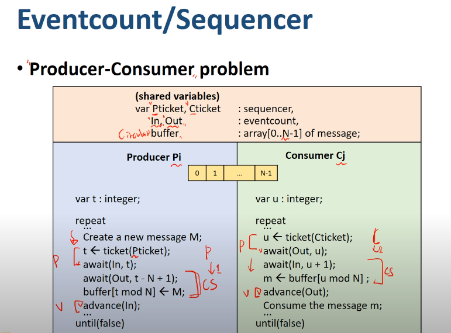

[운영체제 : 정리6] 12~18

(본 자료는 한국 기술 교육 대학교 , 김덕수 교수님의 강의를 바탕으로 직접 정리 하였습니다.)

(https://www.youtube.com/playlist?list=PLBrGAFAIyf5rby7QylRc6JxU5lzQ9c4tN)

(https://sites.google.com/view/hpclab/courses/operating-system)

### :pencil:프로세스 동기화 & 상호배제

- 다중 프로그래밍 시스템
  - 여러개의 프로세스들이 존재
  - 프로세스들은 서로 독립적으로 동시에 동작
  - 공유 자원 또는 데이터가 있을때, 문제가 발생할 수 있다
    - A와 B 두개의 프로세스가 C라는 자원을 동시에 사용하는 경우, A가 C를 바꾸면 B가 사용하는 C도 바뀜
    - 이러한 상황의 문제점을 해결하기 위해 프로그래밍에서는 동기화라는 작업 사용됨
- 동기화
  - 프로세스들이 서로 동작을 맞추는 것
  - 프로세스들이 서로 정보를 공유하는 것

- 비동기적
  - 프로세스들이 서로에 대해 모름
- 병행적
  - 여러 개의 프로세스들이 동시에 시스템에 존재

:arrow_right: <B>병행 수행중인 비동기적 프로세스들이 공유 자원에 동시 접근할 때 문제가 발생할 수 있음</B>

- 공유데이터 (Shared data, Critical Data)
  - 여러 프로세스들이 공유하는 데이터
- 임계 영역 (Critical section)
  - 공유 데이터를 접근하는 코드영역
- 상호배제 (Mutual exclusion)
  - 둘 이상의 프로세스가 동시에 critical section에 진입하는 것을 막는 행위

- 바로 위 사진의 경우에 최종적으로 sdata에 2가 들어갈 수 도 1이 들어갈 수 도 있음, 그 것을 결정하는 것은 중간 중간 premption이 어디서 일어나는지의 유무에 따라
- 1->2->3 ->a->b->c 순으로 작업이 발생하면 당연이 sdata에는 최종적으로 2가 들어가겠지만
- 1->a->b->2->-3->c 순으로 작업이 발생할 경우 sdata에는 양쪽에서 모두 1의 값이 들어옴
  - Race Condition -> 실행 순서에 따라 결과가 달라질 수 있다.

:computer: <b>이러한 상황의 발생을 막기 위해 상호배제 (Mutual Exclusion)라는 개념이 등장함</b>

- 1,2,3이 진행되는 동안 a,b,c가 못들어오도록 막는 작업

- 크리티컬 섹션에 누군가 들어있으면 다른 애를 못들어오게 한다.

- Progress
  - A와 B 둘이 Progress에 진입하려고 달리는 중인데, 서로 Cs안에 못들어가게 막는 것은 불가능 하다. Cs에 먼저 들어가고 나야 그 후에 들어오려는애를 방해할 수 있음

:desktop_computer: 첫 번째 방법

turn값이 0일 경우 P0은 진행되고 turn값이 1일 경우 P1이 진행된다. 각각 들어갔다 나오면서 turn값을 바꿔준다.

- 만약에 0 번작업이 오류로 인해 CS에 들어갈 수 없을경우 , 1번 작업도 맛탱이가 가버림
- 한 Process가 두 번 연속 CS에 진입 불가

:desktop_computer:두 번째 방법

- 각 작업이 들어가 있는지 없는지를 나타내는 flag를 활용한다.
- 상대편의 깃발이 들려있다면 나는 못들어감
- 상대편의 깃발이 다 내려가 있다면 내 깃발을 든 후 CS에 들어가서 일을 하고 CS에서 나올때 깃발을 내리고 나옴

- P0를 진행하던 중 화살표가 발생한 구역에서 preemption이 발생할 경우 P0는 일시적으로 block과 ready상태에 들어가게 되며 P1은 작업이 실행됨, P1이 실행되던 도중 P0가 빼앗겼던 CPU를 다시 받는 경우 P1이 CS안에 들어있는데도 P0가 CS안으로 들어가고자 함

- Flag설정의 위치를 앞에 높음으로서 새로운 방식을 형성

- 화살표의 위치에서 preemption이 발생할 경우, P0와 P1둘 다 상대방이 깃발을 들고 있는 것으로 인식하여 무한대기상태가 발생함

- SW solution의 문제점
  - 속도가 느림
  - 구현이 복잡함
  - ME primitive실행 중 preemtion 될 수 있음
    - 공유 데이터 수정 중은 interrupt를 억제 함으로서 해결 가능
      - overhead 발생
  - Busy Waiting
    - inefficient

### HardWare적인 동기화 문제 해결

- 그러나 프로세스가 3개 이상일 경우, bounded waiting 조건에 위배될 수 있음
  - 계속적으로 작업은 수행되지만 특정 작업의 수행이 계속 미뤄질 수 있음(상황에 따라)

#### Mutual Exclusion Solutions

#### 정수형 변수 S가 Spinlock -> 세가지 연산으로만 접근 가능

- 위 세가지 연산의 atomic을 OS가 보장
  - atomic이란 중간에 preemption이 일어나지 않는 것을 보장해줄게!!
  - S는 물건의 개수 , P는 물건을 빼내는 작업 , V는 물건을 넣는 작업으로 의미

- active는 1인 상태가 열쇠가 문앞에 놓인 상태이고 0은 누군가 열쇠를 이용해서 CS에 들어가서 문을 잠근 상태, 열쇠가 현재 없고 문은 잠겨 있기 때문에 CS에 들어간 애가 문을 열고 나와서 다시 열쇠를 걸기 전까지는 다른 작업들 모두 대기

#### Spinlock의 문제점

- 멀티 프로세서에서 환경에서 사용하는게 효율적임
- 추가 설명 래퍼런스
- (https://goodgid.github.io/Spin-Lock/)

####  Semaphore

- Spinlock처럼 도는 개념이 아닌 readyqueue라는 대기실에서 기다리는 개념

- 생산자 프로세스와 소비자 프로세스의 동기화에 관련된 문제를 해결할 수 있다.
  - 문제란?
    - 생산자의 생산이 끝나기 전에 소비자가 생산자가 하는일을 가져가면 안됨
    - 생산자의 생산이 끝나기 전에 같은 생산자가 다른 생산을 시작하면 안됨

##### Single Buffer 상황에서의 문제

- 생산자가 생산을 하는동안 소비자는 buffer에 접근하여 일을 가져갈 수 없음
- 소비자가 소비하기 위해 buffer에서 물건을 가져가는 동안 생산자는 buffer에 접근할 수 없음
  - consumed -> 소비가 되었니의 유무로서 소비되었을 경우 1, 소비되지 않았을 경우 0
  - produced -> 생산되었니의 유무로서 생산되었을 경우 1 , 생산되지 않았을 경우 0
  - 

- P작업은 확인하는 과정 , V작업은 체크하는 과정
- Produced Semaphore와 Consumed Semaphore는 항상 반대의 값을 가짐

- 버퍼의 사이즈가 n , 생산자도 n , 소비자도 n

- mutexP는 생산자들 간의 문제를 해결하는 변수, 생산자가 여럿일 때 특정 생산자가 자신이 CS에서 일하겠다는 것을 의미함, 일 시작전에 P(mutexP) , 일 시작후에 V(mutexP)
- 소비자의 mutexC도 마찬가지
- 이제부터 nrfull과 nrempty를 살펴보도록 하겠음
  - nrfull -> buffer에 차있는 물건의 수
  - nrempty -> 남아있는 buffer의 수
- P(nrempty) -> buffer에 남은 공간이 있는지 확인 하는 과정
  - 공간이 없으면 대기
  - 공간이 생기면 안으로 들어감 (nrempty가 0보다 크면)
- 물건을 가운데 buffer에 올려 놓는다.
- V(nrfull) -> 물건 수를 하나 늘려준다.
- P(nrfull) -> 물건이 있는지 물어본다. (nufull이 0보다 크면)
- 하나의 작업물을 빼낸다. (nrfull이 하나 줄어듬)
- V(nrempty) -> nrempty공간을 하나 늘려준다.

- Reader의 작업은 동시에 여러명이 작업 가능
- Writer작업은 한 명만 동시에 수행해야함
- Reader가 읽는 동안은 Writer가 수정할 수 없고, Writer가 수정하는 동안은 Reader가 읽을 수 없다.
- Reader와 Writer사이에 상호배제가 필요 , Writer사이에도 상호배제가 필요

##### reader preference solution

:heavy_check_mark:A라는 reader가 글을 읽는 도중 1이라는 writer가 도착, reader가 우선권이므로 1은 대기상태, 그런데 A가 다 읽기전에 B라는 reader가 도착, 그러면 1은 먼저왔지만 reader가 우선권이므로 B가 먼저 작업 수행...... 결과적으로 writer가 무한하게 대기해야하는 상태가 발생가능

- wmutex
- rmutex
- nreaders -> 리더의 수를 의미하는 변수
- 처음에 reader의 수를 체크 -> 0명일 경우 : writer한테 너 기다려!!!를 명령 , 0보다 클 경우 그냥 보는애랑 같이 보기, 리더 수 += 1
- 읽기 과정
- 다 읽은애가 읽는 사람 수 -=1 만약에 내가 마지막에 탈출할 경우 writer에게 너 써도됨!!! 을 의미, 그러나 마지막 탈출 요소가 아닐 경우 그냥 -=1하고 나가면 끝

- Sequencer -> 번호표 뽑는 기계
- ticket(s) -> 티켓을 뽑는다고 생각하면 됨 (내가 뽑으면 나는 현재번호), sequencer에는 +1

- 은행원이 번호표 순서대로 부르는거라고 생각하면됨
  - Read -> 현재 몇번을 은행원이 하고 있는지 보기
  - advance -> 은행원이 번호 증가시킴
  - await ->  내 번호가 현재 은행원이 일하는 번호보다 크니까 스케줄러 불러서 기다리라고 하는 작엄

- starvation 문제 해결

- 생산자가 Pticket으로 번호표를 뽑음 (t)
- 소비자가 Cticket으로 번호표를 뽑음(u)
- await(Out, t- N+1) : 생산자가 물건을 생산할떄 공간이 있는지 확인
- await(IN,u+1) : 소비자가 물건이 있는지 확인

### Language-Level-solution

