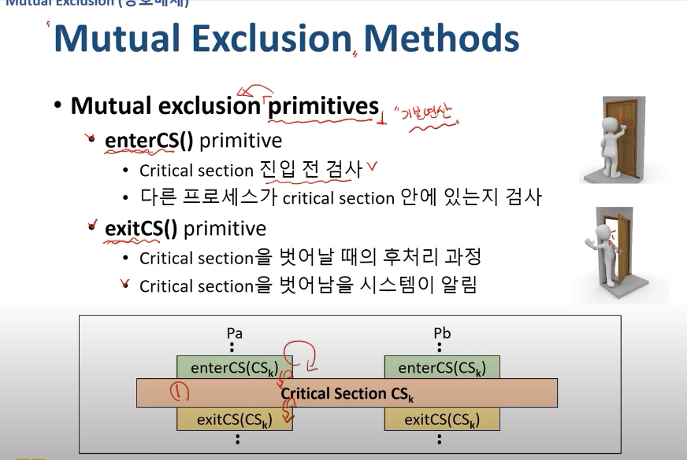
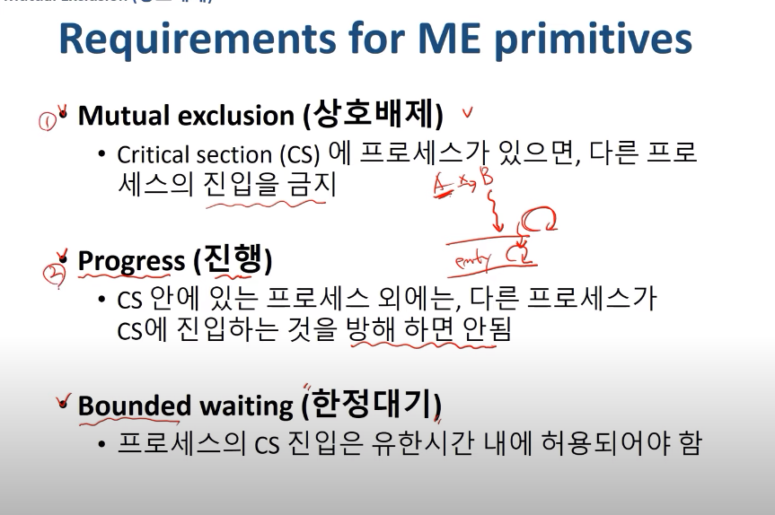

[운영체제 : 정리6] 12~18

(본 자료는 한국 기술 교육 대학교 , 김덕수 교수님의 강의를 바탕으로 직접 정리 하였습니다.)

(https://www.youtube.com/playlist?list=PLBrGAFAIyf5rby7QylRc6JxU5lzQ9c4tN)

(https://sites.google.com/view/hpclab/courses/operating-system)

### :pencil:프로세스 동기화 & 상호배제

- 다중 프로그래밍 시스템
  - 여러개의 프로세스들이 존재
  - 프로세스들은 서로 독립적으로 동시에 동작
  - 공유 자원 또는 데이터가 있을때, 문제가 발생할 수 있다
    - A와 B 두개의 프로세스가 C라는 자원을 동시에 사용하는 경우, A가 C를 바꾸면 B가 사용하는 C도 바뀜
    - 이러한 상황의 문제점을 해결하기 위해 프로그래밍에서는 동기화라는 작업 사용됨
- 동기화
  - 프로세스들이 서로 동작을 맞추는 것
  - 프로세스들이 서로 정보를 공유하는 것

- 비동기적
  - 프로세스들이 서로에 대해 모름
- 병행적
  - 여러 개의 프로세스들이 동시에 시스템에 존재

:arrow_right: <B>병행 수행중인 비동기적 프로세스들이 공유 자원에 동시 접근할 때 문제가 발생할 수 있음</B>

- 공유데이터 (Shared data, Critical Data)
  - 여러 프로세스들이 공유하는 데이터
- 임계 영역 (Critical section)
  - 공유 데이터를 접근하는 코드영역
- 상호배제 (Mutual exclusion)
  - 둘 이상의 프로세스가 동시에 critical section에 진입하는 것을 막는 행위

- 바로 위 사진의 경우에 최종적으로 sdata에 2가 들어갈 수 도 1이 들어갈 수 도 있음, 그 것을 결정하는 것은 중간 중간 premption이 어디서 일어나는지의 유무에 따라
- 1->2->3 ->a->b->c 순으로 작업이 발생하면 당연이 sdata에는 최종적으로 2가 들어가겠지만
- 1->a->b->2->-3->c 순으로 작업이 발생할 경우 sdata에는 양쪽에서 모두 1의 값이 들어옴
  - Race Condition -> 실행 순서에 따라 결과가 달라질 수 있다.

:computer: <b>이러한 상황의 발생을 막기 위해 상호배제 (Mutual Exclusion)라는 개념이 등장함</b>

- 1,2,3이 진행되는 동안 a,b,c가 못들어오도록 막는 작업

- 크리티컬 섹션에 누군가 들어있으면 다른 애를 못들어오게 한다.

- Progress
  - A와 B 둘이 Progress에 진입하려고 달리는 중인데, 서로 Cs안에 못들어가게 막는 것은 불가능 하다. Cs에 먼저 들어가고 나야 그 후에 들어오려는애를 방해할 수 있음

:desktop_computer: 첫 번째 방법

turn값이 0일 경우 P0은 진행되고 turn값이 1일 경우 P1이 진행된다. 각각 들어갔다 나오면서 turn값을 바꿔준다.

- 만약에 0 번작업이 오류로 인해 CS에 들어갈 수 없을경우 , 1번 작업도 맛탱이가 가버림
- 한 Process가 두 번 연속 CS에 진입 불가

:desktop_computer:두 번째 방법

- 각 작업이 들어가 있는지 없는지를 나타내는 flag를 활용한다.
- 상대편의 깃발이 들려있다면 나는 못들어감
- 상대편의 깃발이 다 내려가 있다면 내 깃발을 든 후 CS에 들어가서 일을 하고 CS에서 나올때 깃발을 내리고 나옴

- P0를 진행하던 중 화살표가 발생한 구역에서 preemption이 발생할 경우 P0는 일시적으로 block과 ready상태에 들어가게 되며 P1은 작업이 실행됨, P1이 실행되던 도중 P0가 빼앗겼던 CPU를 다시 받는 경우 P1이 CS안에 들어있는데도 P0가 CS안으로 들어가고자 함

- Flag설정의 위치를 앞에 높음으로서 새로운 방식을 형성

- 화살표의 위치에서 preemption이 발생할 경우, P0와 P1둘 다 상대방이 깃발을 들고 있는 것으로 인식하여 무한대기상태가 발생함

- SW solution의 문제점
  - 속도가 느림
  - 구현이 복잡함
  - ME primitive실행 중 preemtion 될 수 있음
    - 공유 데이터 수정 중은 interrupt를 억제 함으로서 해결 가능
      - overhead 발생
  - Busy Waiting
    - inefficient